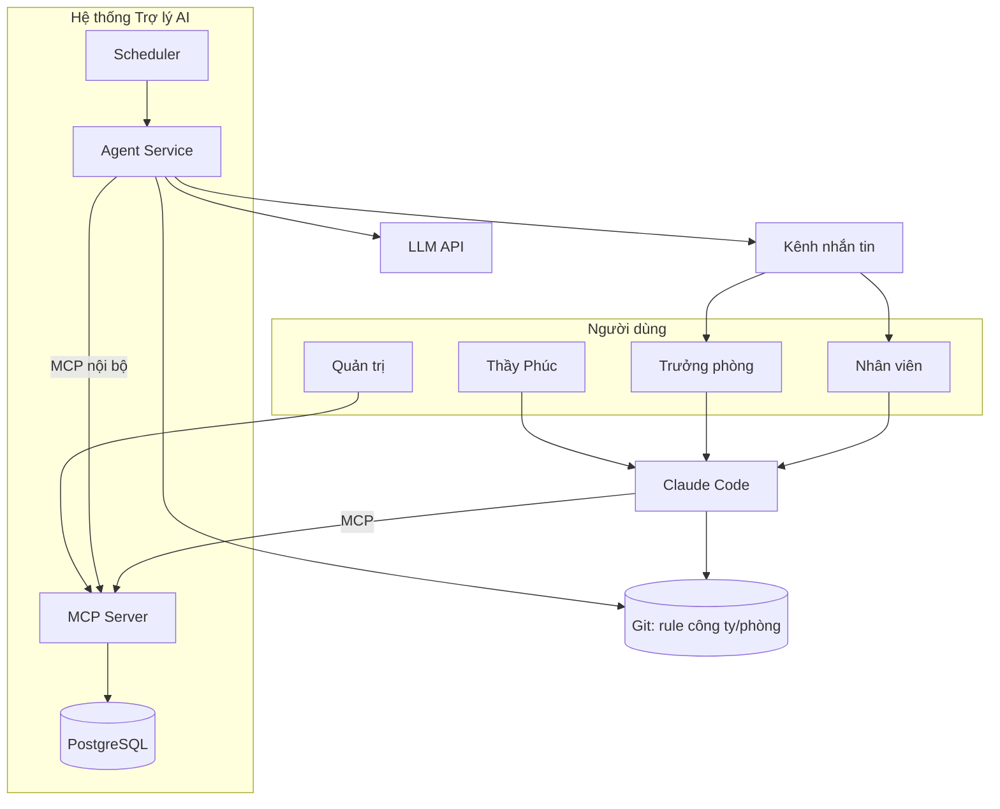

# Đặc tả yêu cầu hệ thống (SRS)
## Hệ thống Trợ lý AI phân cấp theo chu trình PDCA

| Mục | Giá trị |
|---|---|
| Mã tài liệu | AIA-SRS-001 |
| Phiên bản | 0.2 (bản nháp, đang soạn) |
| Ngày | 2026-10-02 |
| Chuẩn tham chiếu | ISO/IEC/IEEE 29148:2018 (Requirements engineering) |
| Tác giả | Lăng Tuấn Anh (IT / Backend) |
| Chủ sở hữu nghiệp vụ | Thầy Phúc |
| Trạng thái | Nháp, chờ rà soát |

> **Quy ước.** Từ "phải" (shall) chỉ yêu cầu bắt buộc, "nên" (should) chỉ yêu cầu mong muốn, "có thể" (may) chỉ tùy chọn. Mỗi yêu cầu có mã duy nhất để truy vết sang SDD, HLD, LLD. Cột **Ưu tiên** theo MoSCoW (M/S/C/W). Cột **Pha** là P1 (MVP một phòng ban), P2 (RAG, phân quyền mở rộng, tổng hợp nhiều cấp), P3 (mở rộng toàn công ty).

### Lịch sử thay đổi

| Phiên bản | Ngày | Nội dung |
|---|---|---|
| 0.1 | 2026-10-01 | Bản nháp đầu tiên, dựa trên sơ đồ tổng quan và các trao đổi ý tưởng |
| 0.2 | 2026-10-02 | (Đang soạn) Hai cửa vào song song: web chat là cửa chính, Claude Code + MCP là cửa phụ, dùng chung một registry tool (FR-AUTH-02, FR-AUTH-06..08, EIR-09, OI-03, OI-11). Báo cáo do trợ lý soạn luôn ở trạng thái nháp, người dùng xác nhận trên web (UC-04, NFR-USE-01) |

---

## 1. Giới thiệu

### 1.1 Mục đích
Tài liệu xác định yêu cầu cho Hệ thống Trợ lý AI phân cấp ("Hệ thống"): mỗi nhân viên, trưởng phòng và thầy Phúc có một trợ lý AI; các trợ lý báo cáo lên nhau theo cơ cấu tổ chức, vận hành chu trình PDCA (Plan – Do – Check – Action) lặp lại. Đối tượng đọc: thầy Phúc (chủ nghiệp vụ), trưởng phòng, đội phát triển, người quản trị.

### 1.2 Phạm vi
**Trong phạm vi:**
- Lưu và quản lý kế hoạch phân cấp (năm, tháng, tuần, ngày), task, báo cáo, hoạt động.
- Cung cấp dữ liệu và công cụ cho trợ lý AI thông qua giao thức MCP (Model Context Protocol).
- Chủ động nhắc việc, hỏi tiến độ, thu thập vướng mắc theo lịch.
- Tổng hợp báo cáo theo cấp (nhân viên → trưởng phòng → thầy Phúc) và đề xuất chỉnh sửa kế hoạch (Action) để người có thẩm quyền duyệt.
- Phân phối bộ nguyên tắc làm việc theo ba lớp (công ty, phòng ban, cá nhân).
- Truy xuất tài liệu (RAG) và "second brain" cá nhân (P2 trở đi).
- Phân quyền theo vai trò và theo thành viên project; ghi nhật ký kiểm toán.

**Ngoài phạm vi:**
- Tự động ra quyết định thay con người (AI chỉ đề xuất).
- Chấm điểm, đánh giá hiệu suất hoặc xử lý nhân sự.
- Huấn luyện hoặc tinh chỉnh model.
- Thay thế công cụ quản lý mã nguồn, chấm công, kế toán.
- Truy cập hoặc trích xuất lịch sử chat thô của người dùng trên claude.ai.

### 1.3 Định nghĩa, từ viết tắt

| Thuật ngữ | Giải thích |
|---|---|
| PDCA | Plan – Do – Check – Action: chu trình cải tiến liên tục |
| MCP | Model Context Protocol, giao thức chuẩn mở để trợ lý AI gọi công cụ và đọc dữ liệu |
| Trợ lý AI | Một cấu hình agent (bộ rule + tập tool được phép) phục vụ một người ở một cấp |
| Second brain | Kho tri thức cá nhân của từng người: ghi chú, SOP, bài học, cách làm việc |
| Context engineering | Cách đưa đúng phần tri thức vào đúng lúc cho AI (nạp gì, bao nhiêu, thứ tự nào) |
| Lớp rule | Ba tầng nguyên tắc: Công ty, Phòng ban, Cá nhân |
| Check | Bước thu thập tiến độ, vướng mắc, xung đột lịch |
| Action | Bước đề xuất và áp dụng chỉnh sửa kế hoạch dựa trên Check |
| RAG | Retrieval-Augmented Generation: truy xuất tài liệu để trả lời kèm nguồn |
| ACL | Danh sách kiểm soát truy cập |
| Agent service | Dịch vụ chạy nền gọi LLM API để soạn tin, phân tích, tổng hợp |
| Kênh nhắn tin | Nơi trợ lý chủ động liên lạc với người dùng (Slack, email, Teams, Zalo...) |

### 1.4 Tài liệu tham chiếu
- ISO/IEC/IEEE 29148:2018, Systems and software engineering – Life cycle processes – Requirements engineering.
- IEEE 1016-2009, Software design descriptions (xem tài liệu AIA-SDD-001).
- Đặc tả Model Context Protocol (Streamable HTTP, Authorization).
- Tài liệu Claude Code về MCP, hook, plugin; tài liệu Claude Tag (đã khảo sát, xem 1.5).
- AIA-HLD-001, AIA-SDD-001, AIA-LLD-001 (bộ tài liệu đi kèm).

### 1.5 Bối cảnh quyết định đã có
- Đội kỹ thuật làm việc chủ yếu trên **Claude Code**; phần lớn nhân viên không dùng công cụ này.
- **Hai cửa vào song song (v0.2):** web chat là cửa vào chính cho mọi người; Claude Code + MCP là cửa phụ cho người làm kỹ thuật. Hai cửa dùng chung lớp nghiệp vụ, phân quyền và registry tool (HLD ADR-014).
- Công ty **không dùng Active Directory**; người dùng và vai trò do chính Hệ thống quản lý.
- **Claude Tag** (agent của Anthropic trong Slack) được khảo sát và **không chọn làm nền chính** vì: routine không nhắn riêng từng người, mọi người trong kênh có quyền như nhau, MCP server phải truy cập được qua internet. Có thể dùng bổ trợ ở pha sau.
- Phương án chọn: **tự xây** MCP server + agent service + scheduler, dùng chung một backend dữ liệu.
- Chưa có tài liệu cũ cần di cư; chưa chốt nền tảng lưu trữ tài liệu và kênh nhắn tin.

---

## 2. Mô tả tổng quan

### 2.1 Bối cảnh sản phẩm
Hệ thống mới, độc lập. Tương tác với: Claude Code trên máy nhân viên, LLM API (Claude API hoặc nhà cung cấp tương đương qua lớp trừu tượng), kênh nhắn tin, kho git chứa rule, và (P2) nguồn tài liệu.

### 2.2 Chức năng ở mức tổng quát
1. **Plan**: thầy Phúc và trưởng phòng lập kế hoạch dài hạn rồi chia nhỏ thành tháng, tuần, ngày.
2. **Do**: giao việc cho nhân viên; nhân viên làm việc cùng trợ lý AI.
3. **Check**: trợ lý chủ động hỏi tiến độ, thu thập vướng mắc và xung đột lịch, tổng hợp lên cấp trên.
4. **Action**: trợ lý đề xuất chỉnh kế hoạch; người có thẩm quyền duyệt rồi áp dụng.
5. Lặp lại chu trình theo nhịp ngày/tuần/tháng.
6. Nhân bản nguyên tắc làm việc xuống mọi trợ lý bằng kế thừa theo lớp.

### 2.3 Nhóm người dùng

| Mã | Vai trò | Mô tả | Cấp trợ lý |
|---|---|---|---|
| ACT-01 | Nhân viên (`staff`) | Thực hiện task, báo cáo, dùng second brain | Trợ lý nhân viên |
| ACT-02 | Trưởng phòng (`dept_head`) | Quản lý phòng, duyệt Action trong phạm vi phòng | Trợ lý trưởng phòng |
| ACT-03 | Thầy Phúc (`director`) | Lập kế hoạch công ty, định ra nguyên tắc, duyệt Action cấp công ty | Trợ lý thầy Phúc |
| ACT-04 | Quản trị hệ thống (`admin`) | Cấp tài khoản, cấu hình, vận hành | Không có trợ lý nghiệp vụ |
| ACT-05 | Scheduler | Tác nhân tự động kích hoạt công việc theo lịch | Không |
| ACT-06 | Hệ thống ngoài | LLM API, kênh nhắn tin, kho git | Không |

### 2.4 Môi trường vận hành
- Máy chủ Linux tự quản (Docker Compose), truy cập qua LAN hoặc VPN.
- Claude Code trên máy nhân viên (Windows/macOS/Linux) kết nối MCP server qua HTTPS.
- Agent service gọi ra LLM API qua internet; MCP server và database không cần mở ra internet.

### 2.5 Ràng buộc thiết kế và triển khai (DC)

| Mã | Ràng buộc |
|---|---|
| DC-01 | Giao tiếp giữa trợ lý và hệ thống qua giao thức MCP, transport Streamable HTTP. |
| DC-02 | Không phụ thuộc Active Directory; quản lý người dùng và vai trò trong cơ sở dữ liệu của Hệ thống. |
| DC-03 | Cơ sở dữ liệu PostgreSQL; migration quản lý bằng Flyway làm nguồn duy nhất của DDL. |
| DC-04 | Lớp truy cập LLM phải trừu tượng hóa nhà cung cấp, đổi model bằng cấu hình. |
| DC-05 | Rule công ty và phòng ban lưu dạng Markdown trong git để có phiên bản. |
| DC-06 | Dữ liệu nghiệp vụ nhạy cảm chỉ đi qua dịch vụ LLM có điều khoản thương mại (không dùng gói cá nhân cho dữ liệu thật). |
| DC-07 | Không dùng đường truy cập model không chính thức hoặc vi phạm điều khoản của nhà cung cấp (ví dụ proxy dùng OAuth của IDE). |
| DC-08 | Kênh nhắn tin là cổng cắm qua adapter, không gắn cứng vào một nền tảng. |

### 2.6 Giả định và phụ thuộc
- GA-01: Mỗi nhân viên có máy cài được Claude Code và truy cập được MCP server.
- GA-02: Nhân viên có tài khoản trên ít nhất một kênh nhắn tin chung (chưa chốt).
- GA-03: Có ngân sách cho LLM API tính theo token.
- GA-04: Thầy Phúc cung cấp được bộ nguyên tắc làm việc dưới dạng văn bản trong giai đoạn khởi động.
- GA-05: Đặc tả MCP và SDK còn thay đổi; Hệ thống dùng chế độ stateless và cập nhật SDK định kỳ.

---

## 3. Use case

| Mã | Tên | Tác nhân | Pha |
|---|---|---|---|
| UC-01 | Xác thực người dùng | ACT-01..04 | P1 |
| UC-02 | Xem task của tôi | ACT-01..03 | P1 |
| UC-03 | Ghi nhận hoạt động | ACT-01..03 | P1 |
| UC-04 | Chốt ngày và nộp báo cáo | ACT-01..03 | P1 |
| UC-05 | Nhận nhắc việc và trả lời hỏi tiến độ | ACT-01..03, ACT-05 | P1 |
| UC-06 | Xem vướng mắc của nhóm | ACT-02, ACT-03 | P1 |
| UC-07 | Tổng hợp báo cáo phòng | ACT-02, ACT-05 | P2 |
| UC-08 | Tổng hợp báo cáo công ty | ACT-03, ACT-05 | P2 |
| UC-09 | Lập và chia nhỏ kế hoạch | ACT-02, ACT-03 | P1 |
| UC-10 | Giao task | ACT-02, ACT-03 | P1 |
| UC-11 | Duyệt đề xuất Action | ACT-02, ACT-03 | P2 |
| UC-12 | Quản lý bộ rule theo lớp | ACT-02, ACT-03, ACT-04 | P1 |
| UC-13 | Quản lý người dùng, vai trò, project | ACT-04 | P1 |
| UC-14 | Tìm tài liệu (RAG) | ACT-01..03 | P2 |
| UC-15 | Quản lý second brain | ACT-01..03 | P2 |
| UC-16 | Xem dashboard | ACT-02, ACT-03 | P2 |
| UC-17 | Tra cứu nhật ký kiểm toán | ACT-04 | P1 |

### UC-04 Chốt ngày và nộp báo cáo (mẫu chi tiết)

| Mục | Nội dung |
|---|---|
| Tác nhân chính | Nhân viên |
| Tiền điều kiện | Đã xác thực; có ít nhất một project được gán |
| Luồng chính | 1) Nhân viên yêu cầu chốt ngày trong web chat. 2) Trợ lý tóm tắt công việc trong phiên và dữ liệu hoạt động trong ngày. 3) Trợ lý soạn bản nháp gồm: đã làm, vướng gì, xung đột lịch. 4) Nhân viên sửa đến khi đồng ý. 5) Trợ lý gọi tool lưu báo cáo ở trạng thái `draft_by_agent`. 6) Web hiển thị thẻ bản nháp; nhân viên bấm **Duyệt**. 7) Hệ thống chuyển báo cáo sang `submitted`, ghi audit, trả mã báo cáo. |
| Luồng thay thế | 1a) Nhân viên dùng lệnh `/chot-ngay` trong Claude Code: bước 2–5 diễn ra trong Claude Code, trợ lý trả đường dẫn để nhân viên xác nhận ở bước 6 trên web. 4a) Nhân viên từ chối: không lưu gì. 5a) Đã có báo cáo của project trong ngày: hỏi ghi đè hoặc bổ sung. |
| Ngoại lệ | Token hoặc phiên đăng nhập hết hạn → UC-01. Project không thuộc người dùng → từ chối. |
| Hậu điều kiện | Báo cáo trạng thái `submitted` gắn người, project, ngày. |
| Yêu cầu liên quan | FR-CHK-01..04, FR-AUTH-02, FR-AUD-01, NFR-PRV-01 |

### UC-05 Nhận nhắc việc và trả lời hỏi tiến độ

| Mục | Nội dung |
|---|---|
| Tác nhân chính | Scheduler, Nhân viên |
| Tiền điều kiện | Người dùng đang hoạt động, không nghỉ phép, trong khung giờ cho phép |
| Luồng chính | 1) Scheduler kích hoạt theo lịch. 2) Agent service đọc task, hoạt động đã ghi, lịch. 3) Soạn tin cá nhân hóa, ghi rõ là trợ lý AI thay mặt thầy Phúc. 4) Gửi qua kênh. 5) Nhân viên trả lời tự nhiên. 6) Agent phân tích thành báo cáo có cấu trúc, hỏi lại tối đa một lần nếu mơ hồ. 7) Lưu báo cáo trạng thái `draft_by_agent` hoặc `submitted` theo cấu hình. |
| Luồng thay thế | 5a) Không trả lời: nhắc lại một lần, sau đó đánh dấu `not_reported`, không suy đoán. |
| Hậu điều kiện | Có báo cáo hoặc dấu "chưa báo cáo" cho ngày đó. |
| Yêu cầu liên quan | FR-NTF-01..07, FR-CHK-05..06 |

---

## 4. Yêu cầu chức năng (FR)

### 4.1 Xác thực và danh tính (AUTH)

| Mã | Yêu cầu | Ưu tiên | Pha |
|---|---|---|---|
| FR-AUTH-01 | Hệ thống phải xác thực mọi lời gọi MCP bằng bearer token gắn với một người dùng. | M | P1 |
| FR-AUTH-02 | Danh tính người gọi phải lấy từ token (MCP) hoặc phiên đăng nhập (web), không bao giờ từ tham số do model truyền vào. | M | P1 |
| FR-AUTH-03 | Token phải được lưu dạng băm, có hạn dùng, có thể thu hồi và xoay vòng. | M | P1 |
| FR-AUTH-04 | Hệ thống phải từ chối lời gọi khi token hoặc phiên đăng nhập sai, hết hạn, bị thu hồi hoặc tài khoản bị khóa, và ghi audit. | M | P1 |
| FR-AUTH-05 | Hệ thống nên hỗ trợ OAuth 2.1 (PKCE, khám phá metadata) qua một nhà cung cấp danh tính ngoài, vẫn lấy vai trò từ bảng người dùng của Hệ thống. | S | P2 |
| FR-AUTH-06 | Web chat phải xác thực bằng đăng nhập và phiên phía server: mã phiên lưu dạng băm, cookie `HttpOnly` + `Secure` + `SameSite`, có hạn dùng và thu hồi được. Cách đăng nhập P1 theo OI-11. | M | P1 |
| FR-AUTH-07 | Mọi cửa vào (web chat, MCP) phải dùng chung một registry tool: mỗi tool khai báo một lần với cùng tên, lược đồ vào ra, hành động phân quyền, và cùng đi qua `can` và audit. | M | P1 |
| FR-AUTH-08 | Chế độ giả lập người dùng (đăng nhập thay người khác để thử) chỉ được bật khi môi trường là `dev`; ở `staging`/`prod` phải bị khóa ở server. | M | P1 |

### 4.2 Tổ chức, vai trò, project (ORG)

| Mã | Yêu cầu | Ưu tiên | Pha |
|---|---|---|---|
| FR-ORG-01 | Quản trị phải tạo, sửa, khóa người dùng với vai trò `staff`, `dept_head`, `director`, `admin`. | M | P1 |
| FR-ORG-02 | Hệ thống phải lưu cơ cấu phòng ban và quan hệ báo cáo (người báo cáo cho ai). | M | P1 |
| FR-ORG-03 | Hệ thống phải lưu project và danh sách thành viên theo vai trò trong project. | M | P1 |
| FR-ORG-04 | Mỗi project phải có cấu hình riêng (mốc, chỉ số, câu hỏi riêng cho trợ lý, nhịp Check) lưu dạng có cấu trúc. | M | P1 |
| FR-ORG-05 | Hệ thống phải hỗ trợ trạng thái nghỉ phép/vắng mặt của người dùng để trợ lý bỏ qua. | S | P1 |

### 4.3 Kế hoạch – Plan (PLAN)

| Mã | Yêu cầu | Ưu tiên | Pha |
|---|---|---|---|
| FR-PLAN-01 | Hệ thống phải lưu kế hoạch theo cây cha-con với các mức năm, tháng, tuần, ngày. | M | P1 |
| FR-PLAN-02 | Mỗi kế hoạch phải có mục tiêu, thời gian, chủ sở hữu, project (nếu có), trạng thái. | M | P1 |
| FR-PLAN-03 | Hệ thống phải cho tạo kế hoạch con từ kế hoạch cha và kiểm tra khoảng thời gian con nằm trong cha. | M | P1 |
| FR-PLAN-04 | Hệ thống phải lưu lịch sử phiên bản mỗi lần kế hoạch thay đổi (ai, lúc nào, thay gì, lý do). | M | P1 |
| FR-PLAN-05 | Trợ lý nên hỗ trợ đề xuất chia kế hoạch năm thành tháng, tuần, ngày để người dùng duyệt. | S | P2 |
| FR-PLAN-06 | Chỉ chủ sở hữu hoặc cấp trên có thẩm quyền mới được sửa kế hoạch. | M | P1 |

### 4.4 Task và hoạt động – Do (TASK, ACT)

| Mã | Yêu cầu | Ưu tiên | Pha |
|---|---|---|---|
| FR-TASK-01 | Hệ thống phải lưu task gắn kế hoạch cha, project, người thực hiện, hạn, trạng thái. | M | P1 |
| FR-TASK-02 | Cấp trên phải giao được task cho cấp dưới trong phạm vi quản lý. | M | P1 |
| FR-TASK-03 | Người dùng phải xem được danh sách task của mình theo trạng thái. | M | P1 |
| FR-TASK-04 | Người thực hiện phải cập nhật được trạng thái và ghi chú tiến độ. | M | P1 |
| FR-TASK-05 | Hệ thống phải lưu lịch sử thay đổi trạng thái task. | S | P1 |
| FR-ACT-01 | Hệ thống phải cho ghi nhận hoạt động ngắn (đã làm gì) gắn task/project, do người dùng hoặc trợ lý ghi sau khi người dùng đồng ý. | M | P1 |
| FR-ACT-02 | Hoạt động chỉ chứa bản tóm tắt người dùng đã duyệt, không chứa nội dung chat thô. | M | P1 |
| FR-ACT-03 | Hệ thống nên hỗ trợ hook của Claude Code gọi ghi nhận hoạt động khi kết thúc phiên, có bước xác nhận hoặc chế độ nháp. | S | P2 |

### 4.5 Báo cáo và thu thập vướng mắc – Check (CHK)

| Mã | Yêu cầu | Ưu tiên | Pha |
|---|---|---|---|
| FR-CHK-01 | Báo cáo ngày phải theo mẫu cố định: đã làm, vướng gì, xung đột lịch, kèm project và ngày. | M | P1 |
| FR-CHK-02 | Hệ thống phải hỗ trợ lệnh "chốt ngày" tạo bản nháp từ hoạt động trong ngày để người dùng sửa và nộp. | M | P1 |
| FR-CHK-03 | Hệ thống phải đảm bảo mỗi người có tối đa một báo cáo cho mỗi project mỗi ngày (có thể bổ sung). | M | P1 |
| FR-CHK-04 | Báo cáo phải có trạng thái: `draft_by_agent`, `submitted`, `not_reported`. | M | P1 |
| FR-CHK-05 | Agent phải phân tích câu trả lời tự nhiên thành các trường của báo cáo và hỏi lại tối đa một lần khi mơ hồ. | M | P1 |
| FR-CHK-06 | Báo cáo phải cho phép đánh dấu mức độ vướng mắc (mức độ, loại: kỹ thuật, nhân sự, phụ thuộc bên ngoài, lịch). | S | P1 |
| FR-CHK-07 | Câu hỏi Check phải tùy biến theo cấu hình project (FR-ORG-04). | S | P1 |
| FR-CHK-08 | Hệ thống phải đọc được lịch để phát hiện xung đột (Google Calendar hoặc Outlook), nếu chưa có thì dựa vào lời khai và đánh dấu nguồn. | C | P2 |

### 4.6 Nhắc việc và liên lạc chủ động (NTF)

| Mã | Yêu cầu | Ưu tiên | Pha |
|---|---|---|---|
| FR-NTF-01 | Scheduler phải kích hoạt các tác vụ theo lịch cấu hình, múi giờ Asia/Bangkok. | M | P1 |
| FR-NTF-02 | Trợ lý phải gửi nhắc việc đầu ngày và hỏi tiến độ cuối ngày, nội dung cá nhân hóa theo task và lịch. | M | P1 |
| FR-NTF-03 | Mỗi tin nhắn phải nêu rõ là trợ lý AI thay mặt người cấp trên, không phải người đó trực tiếp nhắn. | M | P1 |
| FR-NTF-04 | Hệ thống phải giới hạn số tin mỗi người mỗi ngày, tôn trọng khung giờ làm việc và trạng thái nghỉ phép. | M | P1 |
| FR-NTF-05 | Khi không có phản hồi, hệ thống phải nhắc lại một lần rồi đánh dấu `not_reported`; không tự suy đoán nội dung. | M | P1 |
| FR-NTF-06 | Việc leo thang lên trưởng phòng phải do con người quyết định; hệ thống chỉ hiển thị danh sách chưa báo cáo. | M | P1 |
| FR-NTF-07 | Kênh gửi phải cắm được qua adapter; hỗ trợ tối thiểu một kênh ở P1 (email hoặc kênh nhắn tin đã chọn). | M | P1 |

### 4.7 Tổng hợp theo cấp (AGG)

| Mã | Yêu cầu | Ưu tiên | Pha |
|---|---|---|---|
| FR-AGG-01 | Hệ thống phải tổng hợp báo cáo ngày của phòng thành bản tóm tắt cuối ngày cho trưởng phòng. | M | P2 |
| FR-AGG-02 | Hệ thống phải tổng hợp báo cáo các phòng thành bản tóm tắt cho thầy Phúc. | M | P2 |
| FR-AGG-03 | Bản tổng hợp phải nêu số liệu (đã báo/chưa báo), vướng mắc nổi bật, rủi ro về tiến độ, kèm liên kết về báo cáo gốc. | M | P2 |
| FR-AGG-04 | Bản tổng hợp cấp trên chỉ gồm báo cáo đã nộp, không gồm second brain hoặc ghi chú cá nhân. | M | P2 |
| FR-AGG-05 | Hệ thống nên hỗ trợ tổng hợp theo tuần và tháng. | S | P2 |

### 4.8 Đề xuất và áp dụng Action (ACTN)

| Mã | Yêu cầu | Ưu tiên | Pha |
|---|---|---|---|
| FR-ACTN-01 | Trợ lý phải sinh đề xuất chỉnh kế hoạch (dời mốc, chia lại việc, cảnh báo rủi ro) từ dữ liệu Check, mỗi đề xuất kèm căn cứ. | M | P2 |
| FR-ACTN-02 | Đề xuất phải ở trạng thái `proposed` cho đến khi người có thẩm quyền duyệt (`approved`/`rejected`). | M | P2 |
| FR-ACTN-03 | Chỉ khi `approved` hệ thống mới áp dụng thay đổi vào kế hoạch và ghi phiên bản (FR-PLAN-04). | M | P2 |
| FR-ACTN-04 | AI không được tự áp dụng thay đổi kế hoạch trong bất kỳ trường hợp nào. | M | P2 |
| FR-ACTN-05 | Hệ thống phải lưu lý do duyệt hoặc từ chối. | S | P2 |

### 4.9 Bộ rule theo lớp (RULE)

| Mã | Yêu cầu | Ưu tiên | Pha |
|---|---|---|---|
| FR-RULE-01 | Rule phải chia ba lớp: Công ty (chỉ thầy Phúc sửa), Phòng ban (trưởng phòng sửa), Cá nhân (chủ sở hữu sửa). | M | P1 |
| FR-RULE-02 | Trợ lý của mỗi người phải được ghép từ lớp công ty + lớp phòng + lớp cá nhân lúc chạy, không sao chép. | M | P1 |
| FR-RULE-03 | Sửa lớp trên phải tự cập nhật cho mọi trợ lý cấp dưới ở phiên sau. | M | P1 |
| FR-RULE-04 | Rule công ty và phòng ban phải có lịch sử phiên bản (git) và truy vết người sửa. | M | P1 |
| FR-RULE-05 | Khi hai lớp mâu thuẫn, lớp trên thắng đối với quy định bắt buộc; lớp dưới chỉ bổ sung. | M | P1 |
| FR-RULE-06 | Hệ thống phải hỗ trợ đóng gói rule thành plugin/skill dùng chung cho Claude Code. | M | P1 |

### 4.10 Truy xuất tài liệu và second brain (RAG, SB)

| Mã | Yêu cầu | Ưu tiên | Pha |
|---|---|---|---|
| FR-RAG-01 | Hệ thống phải lập chỉ mục tài liệu (văn bản) thành các đoạn có vector và siêu dữ liệu quyền. | M | P2 |
| FR-RAG-02 | Truy xuất phải lọc theo quyền của người gọi trước khi đưa vào ngữ cảnh. | M | P2 |
| FR-RAG-03 | Kết quả phải kèm nguồn (tài liệu, vị trí) để kiểm chứng. | M | P2 |
| FR-RAG-04 | Nguồn tài liệu phải cắm được qua adapter (git, Drive, Notion, thư mục). | S | P2 |
| FR-SB-01 | Mỗi người có một không gian second brain riêng, chỉ chủ sở hữu đọc. | M | P2 |
| FR-SB-02 | Nội dung second brain không được đưa lên cấp trên; chỉ báo cáo đã duyệt mới đi lên. | M | P2 |
| FR-SB-03 | Người dùng nên dùng được công cụ ghi chú của riêng mình; hệ thống chỉ đồng bộ phần người dùng chọn. | S | P3 |

### 4.11 Dashboard và kiểm toán (DASH, AUD)

| Mã | Yêu cầu | Ưu tiên | Pha |
|---|---|---|---|
| FR-DASH-01 | Trưởng phòng phải xem được tình trạng báo cáo, vướng mắc, tiến độ task của phòng. | S | P2 |
| FR-DASH-02 | Thầy Phúc phải xem được tổng hợp toàn công ty và tiến độ kế hoạch năm/tháng. | S | P2 |
| FR-DASH-03 | Dashboard phải tôn trọng cùng quy tắc phân quyền như MCP. | M | P2 |
| FR-AUD-01 | Mọi lời gọi tool phải ghi audit: ai, tool, tham số rút gọn, kết quả (thành công/lỗi), thời điểm. | M | P1 |
| FR-AUD-02 | Audit log phải chỉ thêm, không sửa/xóa qua ứng dụng. | M | P1 |
| FR-AUD-03 | Quản trị phải tra cứu được audit theo người, tool, khoảng thời gian. | S | P1 |

### 4.12 Trợ lý AI và định tuyến model (AGT)

| Mã | Yêu cầu | Ưu tiên | Pha |
|---|---|---|---|
| FR-AGT-01 | Mỗi cấp trợ lý phải có tập tool được phép riêng, thực thi ở phía server. | M | P1 |
| FR-AGT-02 | Agent service phải định tuyến việc tới model theo cấu hình: model nhỏ cho soạn tin/phân tích, model mạnh cho tổng hợp và đề xuất Action. | S | P2 |
| FR-AGT-03 | Agent service phải bật prompt caching hoặc cơ chế tương đương cho phần rule cố định khi nhà cung cấp hỗ trợ. | S | P2 |
| FR-AGT-04 | Agent service phải đo và ghi lại token và chi phí theo tác vụ. | S | P2 |
| FR-AGT-05 | Nội dung do người dùng nhập (báo cáo, ghi chú) phải được coi là dữ liệu không đáng tin, không được thực thi như chỉ thị. | M | P1 |

---

## 5. Yêu cầu phi chức năng (NFR)

### 5.1 Bảo mật (SEC)

| Mã | Yêu cầu |
|---|---|
| NFR-SEC-01 | Mọi kết nối từ Claude Code tới MCP server phải qua HTTPS (TLS 1.2 trở lên). |
| NFR-SEC-02 | Phân quyền phải thực thi ở server theo hai lớp: vai trò và thành viên project; không dựa vào model để từ chối. |
| NFR-SEC-03 | Tài khoản cơ sở dữ liệu của MCP server phải theo nguyên tắc đặc quyền tối thiểu. |
| NFR-SEC-04 | Bí mật (khóa API, mật khẩu DB) không lưu trong mã nguồn; quản lý qua biến môi trường hoặc kho bí mật. |
| NFR-SEC-05 | Đầu ra mỗi tool phải bị giới hạn kích thước và số dòng. |
| NFR-SEC-06 | Hệ thống phải chống tấn công prompt injection qua dữ liệu người dùng: tool chỉ trả dữ liệu, thao tác ghi quan trọng phải có xác nhận của người dùng. |
| NFR-SEC-07 | Cần giới hạn tần suất gọi theo người dùng để chống lạm dụng và vòng lặp lỗi. |

### 5.2 Quyền riêng tư (PRV)

| Mã | Yêu cầu |
|---|---|
| NFR-PRV-01 | Chỉ bản tóm tắt người dùng đã duyệt được lưu lên backend; không lưu nội dung chat thô. |
| NFR-PRV-02 | Phải có tài liệu minh bạch cho nhân viên: dữ liệu nào được thu thập, ai xem, giữ bao lâu. |
| NFR-PRV-03 | Dữ liệu cá nhân phải tuân thủ quy định pháp luật Việt Nam về bảo vệ dữ liệu cá nhân hiện hành; cần bộ phận pháp chế xác nhận trước khi chạy thật. |
| NFR-PRV-04 | Phải có chính sách lưu giữ và xóa: báo cáo, hoạt động, audit có thời hạn lưu cấu hình được. |
| NFR-PRV-05 | Nội dung gửi tới nhà cung cấp LLM phải giới hạn ở mức tối thiểu cần thiết cho tác vụ. |

### 5.3 Hiệu năng (PERF)

| Mã | Yêu cầu |
|---|---|
| NFR-PERF-01 | Tool đọc đơn giản (ví dụ lấy task của tôi) phản hồi trong 500 ms ở phân vị 95 với tối đa 100 người dùng. |
| NFR-PERF-02 | Tool ghi (nộp báo cáo) phản hồi trong 1 s ở phân vị 95. |
| NFR-PERF-03 | Tác vụ tổng hợp cuối ngày cho một phòng hoàn tất trong 10 phút. |
| NFR-PERF-04 | Hệ thống hỗ trợ tối thiểu 100 người dùng đồng thời ở P3 mà không cần thay đổi kiến trúc. |

### 5.4 Tin cậy và sẵn sàng (REL)

| Mã | Yêu cầu |
|---|---|
| NFR-REL-01 | Độ sẵn sàng mục tiêu 99% trong giờ làm việc (P1), mục tiêu cao hơn xác định ở P2. |
| NFR-REL-02 | Sao lưu cơ sở dữ liệu hằng ngày, kiểm thử khôi phục tối thiểu mỗi quý; RPO 24 giờ, RTO 4 giờ. |
| NFR-REL-03 | Tác vụ định kỳ phải idempotent: chạy lại không tạo trùng báo cáo hoặc trùng tin nhắn. |
| NFR-REL-04 | Khi LLM API lỗi, hệ thống phải thử lại có giới hạn và vẫn lưu dữ liệu thô để xử lý sau, không mất báo cáo. |
| NFR-REL-05 | Lỗi của kênh nhắn tin không được làm hỏng luồng tổng hợp; phải ghi nhận và thử lại. |

### 5.5 Khả năng bảo trì, vận hành, quan sát (MNT, OBS)

| Mã | Yêu cầu |
|---|---|
| NFR-MNT-01 | Mã có kiểm thử tự động cho phân quyền và các tool; chạy trong CI. |
| NFR-MNT-02 | Thay đổi schema chỉ qua migration Flyway có phiên bản. |
| NFR-MNT-03 | Thêm project mới không đòi hỏi sửa schema (cấu hình lưu `jsonb`). |
| NFR-OBS-01 | Có log có cấu trúc, số liệu (request, lỗi, độ trễ, token) và cảnh báo khi vượt ngưỡng. |
| NFR-OBS-02 | Có kiểm tra sức khỏe (health check) cho MCP server, agent service, scheduler, database. |

### 5.6 Chi phí và khả năng mở rộng (COST, SCL)

| Mã | Yêu cầu |
|---|---|
| NFR-COST-01 | Có hạn mức chi tiêu LLM theo tháng, cảnh báo ở 80% và dừng tác vụ không thiết yếu ở 100%. |
| NFR-COST-02 | Chi phí LLM ước tính trước cho MVP trên số người, số tương tác mỗi ngày và độ dài báo cáo. |
| NFR-SCL-01 | Hệ thống phải mở rộng từ một phòng ban lên toàn công ty bằng thêm dữ liệu và cấu hình, không viết lại. |
| NFR-SCL-02 | Thêm nhà cung cấp LLM, kênh nhắn tin, nguồn tài liệu qua adapter, không sửa lõi. |

### 5.7 Khả dụng và tuân thủ (USE, CMP)

| Mã | Yêu cầu |
|---|---|
| NFR-USE-01 | Việc thường dùng (xem task, chốt ngày) hoàn thành bằng một câu chat trên web, hoặc một lệnh trong Claude Code cộng một lần bấm xác nhận trên web. |
| NFR-USE-02 | Nội dung tin nhắn và báo cáo bằng tiếng Việt, ngắn gọn, không làm phiền quá giới hạn FR-NTF-04. |
| NFR-CMP-01 | Dùng nhà cung cấp LLM theo điều khoản thương mại, không dùng đường truy cập vi phạm điều khoản (DC-06, DC-07). |

---

## 6. Yêu cầu giao diện bên ngoài (EIR)

| Mã | Giao diện | Yêu cầu |
|---|---|---|
| EIR-01 | Claude Code ↔ MCP Server | MCP qua Streamable HTTP, bearer token; công cụ (tool) và prompt/lệnh theo LLD mục tool. |
| EIR-02 | Agent Service ↔ lớp nghiệp vụ | Dùng cùng lớp dịch vụ nghiệp vụ và cùng bước kiểm tra quyền như MCP Server, chạy với ngữ cảnh người dùng được chỉ định tường minh cho từng tác vụ; mọi thao tác ghi audit. |
| EIR-03 | Agent Service ↔ LLM API | Giao diện trừu tượng `LLMClient`; hỗ trợ tool calling, cache, đo token. |
| EIR-04 | Agent Service ↔ Kênh nhắn tin | Giao diện `ChannelAdapter` gửi và nhận tin, hỗ trợ trả lời theo luồng. |
| EIR-05 | Hệ thống ↔ Git | Đọc rule công ty/phòng ban từ kho git; quyền ghi theo lớp. |
| EIR-06 | Hệ thống ↔ Nguồn lịch | (P2) Đọc lịch rảnh/bận qua API chuẩn của nhà cung cấp lịch. |
| EIR-07 | Hệ thống ↔ Nguồn tài liệu | (P2) Adapter nguồn tài liệu để lập chỉ mục. |
| EIR-08 | Người dùng ↔ Dashboard | (P2) Giao diện web chỉ đọc cho trưởng phòng và thầy Phúc. |
| EIR-09 | Người dùng ↔ Web chat | (P1, cửa vào chính) HTTPS, phiên đăng nhập (FR-AUTH-06). Máy chủ chạy vòng hội thoại qua `LLMClient` có tool calling, gọi tool qua registry chung (FR-AUTH-07). Thao tác có tác động (duyệt, xác nhận báo cáo) đi qua API xác thực bằng phiên, không phải tool mà model gọi được. |

---

## 7. Yêu cầu dữ liệu

| Mã | Yêu cầu |
|---|---|
| DR-01 | Thực thể cốt lõi: người dùng, phòng ban, project, thành viên project, kế hoạch (cây), task, hoạt động, báo cáo, vướng mắc, đề xuất Action, token, audit, lịch gửi tin. |
| DR-02 | Mỗi bản ghi nghiệp vụ có người tạo, thời điểm tạo và cập nhật. |
| DR-03 | Cấu hình project lưu `jsonb`, có kiểm tra theo lược đồ cho từng loại project. |
| DR-04 | Báo cáo lưu cả dạng có cấu trúc lẫn văn bản gốc người dùng đã duyệt. |
| DR-05 | Thời gian lưu trữ theo NFR-PRV-04; xóa mềm cho dữ liệu nghiệp vụ, audit không xóa. |
| DR-06 | Phân loại dữ liệu: Công khai nội bộ, Nội bộ, Hạn chế (second brain, nhân sự). Ba mức này quyết định quyền xem và nội dung được gửi sang LLM. |

---

## 8. Truy vết use case – yêu cầu

| Use case | Yêu cầu chính |
|---|---|
| UC-01 | FR-AUTH-01..04, FR-AUTH-06, FR-AUTH-08 |
| UC-02 | FR-TASK-03, FR-ORG-03 |
| UC-03 | FR-ACT-01..03 |
| UC-04 | FR-CHK-01..04, FR-CHK-06 |
| UC-05 | FR-NTF-01..07, FR-CHK-05, FR-CHK-07 |
| UC-06 | FR-CHK-06, FR-AGG-03, FR-DASH-01 |
| UC-07 | FR-AGG-01, FR-AGG-03, FR-AGG-04 |
| UC-08 | FR-AGG-02..04 |
| UC-09 | FR-PLAN-01..06 |
| UC-10 | FR-TASK-01..02, FR-TASK-05 |
| UC-11 | FR-ACTN-01..05 |
| UC-12 | FR-RULE-01..06 |
| UC-13 | FR-ORG-01..05, FR-AUTH-03 |
| UC-14 | FR-RAG-01..04 |
| UC-15 | FR-SB-01..03 |
| UC-16 | FR-DASH-01..03 |
| UC-17 | FR-AUD-01..03 |

---

## 9. Tiêu chí nghiệm thu mức hệ thống

| Mã | Tiêu chí | Gắn với |
|---|---|---|
| AC-01 | Nhân viên A không đọc được task, báo cáo của nhân viên B trong project khác bằng bất kỳ tool nào, kể cả khi cố ép model truyền `user_id`. | FR-AUTH-02, NFR-SEC-02 |
| AC-02 | Sau khi sửa rule công ty, phiên mới của mọi nhân viên áp dụng nội dung mới mà không phải cài lại thủ công từng bản sao. | FR-RULE-02..03 |
| AC-03 | Với 5 người thử nghiệm trong 2 tuần, hệ thống thu được ít nhất 80% báo cáo ngày đúng mẫu mà không phải nhập tay lại toàn bộ. | FR-CHK-02, FR-NTF-02 |
| AC-04 | Không có thay đổi kế hoạch nào được áp dụng khi chưa có bản ghi duyệt của người có thẩm quyền. | FR-ACTN-02..04 |
| AC-05 | Người không trả lời bị đánh dấu `not_reported`, không có nội dung do AI tự bịa. | FR-NTF-05 |
| AC-06 | Bản tổng hợp cấp trên không chứa nội dung second brain hoặc chat thô. | FR-AGG-04, NFR-PRV-01 |
| AC-07 | Mọi lời gọi tool trong thời gian thử nghiệm đều có bản ghi audit. | FR-AUD-01 |
| AC-08 | Chạy lại tác vụ định kỳ hai lần không tạo bản ghi hoặc tin nhắn trùng. | NFR-REL-03 |

---

## 10. Vấn đề mở và rủi ro

| Mã | Vấn đề | Chủ trì | Ảnh hưởng |
|---|---|---|---|
| OI-01 | Kênh nhắn tin nào (Slack, Teams, Zalo, email)? Zalo OA có giới hạn nhắn chủ động. | Lăng Tuấn Anh | FR-NTF-07, EIR-04 |
| OI-02 | Quy mô công ty, số phòng ban, phòng thử nghiệm và số project? | Thầy Phúc | Chi phí, NFR-PERF |
| OI-03 | ~~Thầy Phúc và các trưởng phòng dùng Claude Code hay cần giao diện web?~~ **Đã chốt (v0.2):** web chat là cửa vào chính cho mọi vai trò; Claude Code là cửa phụ (HLD ADR-014). | Lăng Tuấn Anh | EIR-09 |
| OI-04 | Gói Claude cho nhân viên: Team, API key công ty, hay Pro cá nhân (chỉ phù hợp pilot)? | Ban lãnh đạo | DC-06, chi phí |
| OI-05 | Nguồn đăng nhập chính thức ở P2 (Keycloak tự host, Google, Microsoft)? | Lăng Tuấn Anh | FR-AUTH-05 |
| OI-06 | Tài liệu nằm ở đâu (git, Drive, Notion, thư mục)? Chưa có. | Lăng Tuấn Anh | FR-RAG-04 |
| OI-07 | Chính sách minh bạch với nhân viên về dữ liệu thu thập. | Thầy Phúc | NFR-PRV-02 |
| OI-08 | Xác nhận pháp lý về xử lý dữ liệu cá nhân của nhân viên. | Pháp chế | NFR-PRV-03 |
| OI-09 | Hook Claude Code: tên hook, tham số hiện hành cần kiểm tra trước khi làm. | Lăng Tuấn Anh | FR-ACT-03 |
| OI-10 | Đặc tả MCP còn thay đổi; cần theo dõi bản phát hành. | Lăng Tuấn Anh | GA-05 |
| OI-11 | Cách đăng nhập web ở P1 khi chưa có IdP: mật khẩu băm (argon2id) do quản trị cấp, hay liên kết đăng nhập một lần gửi qua email (phụ thuộc OI-01)? | Lăng Tuấn Anh | FR-AUTH-06 |

| Rủi ro | Mức | Giảm thiểu |
|---|---|---|
| Nhân viên thấy bị giám sát, báo cáo qua loa | Cao | Chỉ báo cáo đã duyệt đi lên; minh bạch; giới hạn số tin |
| Một người phát triển duy nhất (nguy cơ phụ thuộc) | Cao | Cắt phạm vi MVP; tài liệu và kiểm thử đầy đủ |
| Dữ liệu qua tài khoản cá nhân Pro | Cao | DC-06; chuyển sang API/Team trước khi dùng dữ liệu thật |
| Đặc tả MCP/SDK thay đổi | Trung bình | Stateless, khóa phiên bản, kiểm thử tích hợp |
| Prompt injection qua nội dung báo cáo | Trung bình | FR-AGT-05, NFR-SEC-06 |
| Chi phí LLM vượt dự kiến | Trung bình | NFR-COST-01, định tuyến model, caching |
