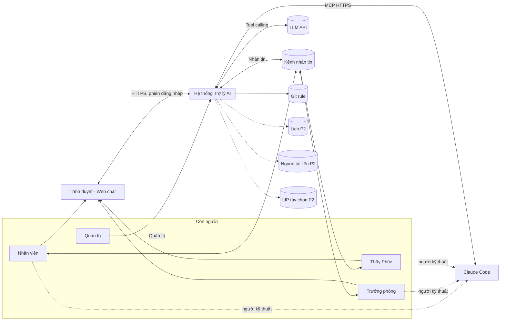
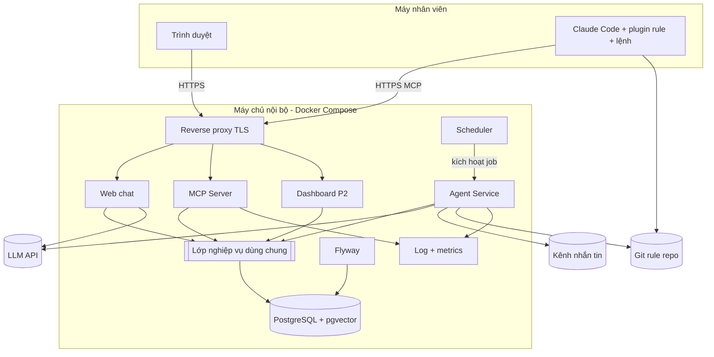
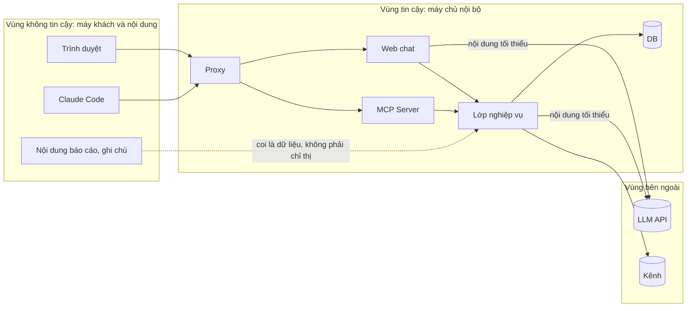
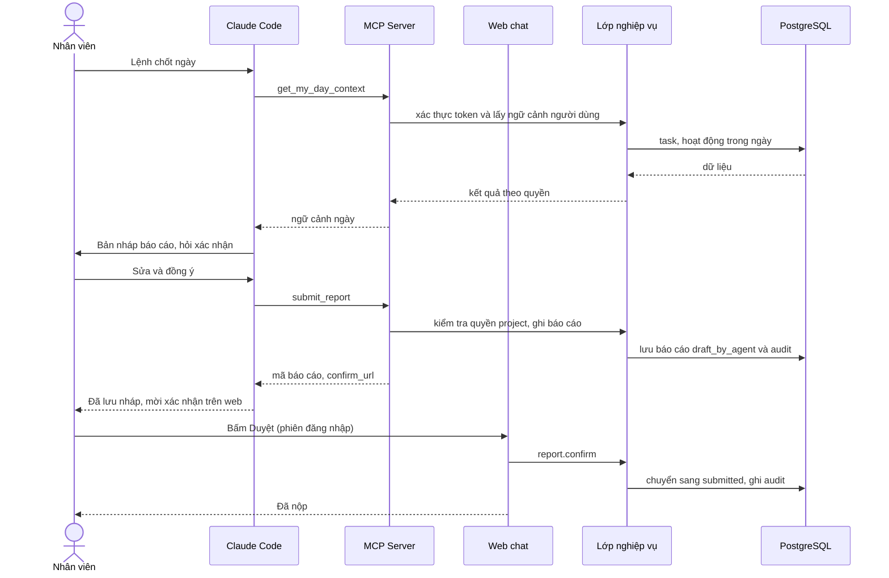
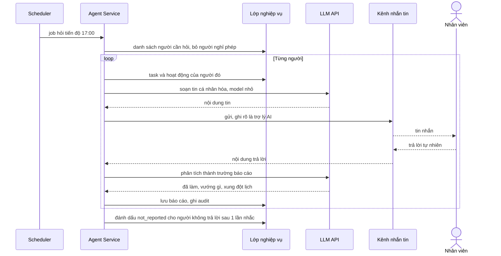
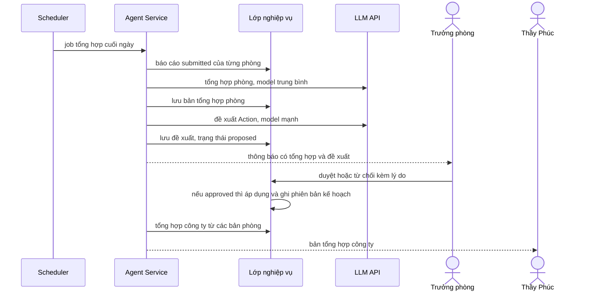
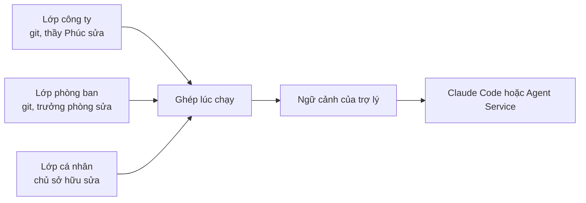
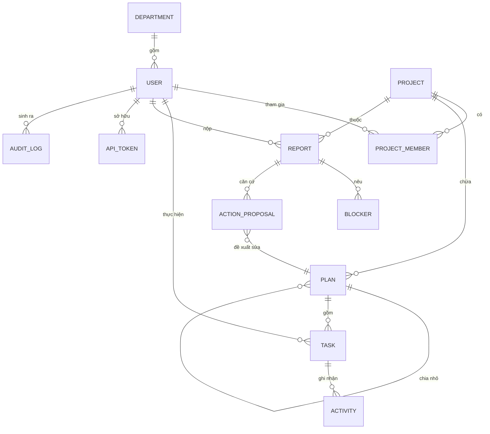
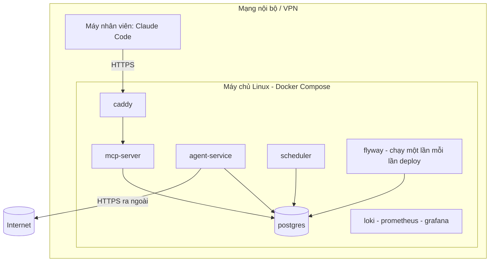

# Thiết kế mức cao (HLD)
## Hệ thống Trợ lý AI phân cấp theo chu trình PDCA

| Mục | Giá trị |
|---|---|
| Mã tài liệu | AIA-HLD-001 |
| Phiên bản | 0.2 (bản nháp, đang soạn) |
| Ngày | 2026-10-02 |
| Căn cứ | AIA-SRS-001 |
| Tác giả | Lăng Tuấn Anh |
| Trạng thái | Nháp, chờ rà soát |

---

## 1. Mục đích và phạm vi
HLD mô tả kiến trúc tổng thể đáp ứng SRS: thành phần, ranh giới, luồng dữ liệu chính, triển khai, bảo mật và các quyết định kiến trúc (ADR). Thiết kế chi tiết nằm ở AIA-LLD-001; góc nhìn thiết kế theo IEEE 1016 nằm ở AIA-SDD-001.

## 2. Động lực kiến trúc

| Động lực | Từ yêu cầu | Hệ quả |
|---|---|---|
| Phân quyền theo từng người, ở server | NFR-SEC-02, FR-AUTH-02 | Danh tính đi cùng mọi lời gọi; tự xây MCP server |
| Hỏi riêng từng người, chủ động | FR-NTF-02..05 | Cần Agent Service và Scheduler riêng |
| Mọi nhân viên dùng được, kể cả người không rành kỹ thuật | NFR-USE-01, EIR-09 | Web chat là cửa vào chính; Claude Code + MCP là cửa phụ (ADR-015) |
| Hai cửa vào không được lệch hành vi | FR-AUTH-07 | Một registry tool trong `pdca_core`, mỗi cửa vào chỉ là lớp vỏ mỏng |
| Dữ liệu PDCA có cấu trúc | FR-PLAN, FR-TASK, FR-CHK | PostgreSQL; RAG chỉ cho văn bản |
| Nhân bản nguyên tắc bằng kế thừa | FR-RULE-01..06 | Rule ba lớp trong git, ghép lúc chạy |
| AI chỉ đề xuất | FR-ACTN-04 | Trạng thái `proposed` và bước duyệt bắt buộc |
| Không phụ thuộc AD | DC-02 | Bảng người dùng nội bộ, IdP ngoài là tùy chọn |
| Đổi nhà cung cấp LLM/kênh | DC-04, DC-08 | Lớp adapter |
| Một người phát triển chính | Rủi ro RK-01 | Ít thành phần, công nghệ quen thuộc, cắt phạm vi |

## 3. Nguyên tắc kiến trúc
1. **Một nguồn sự thật.** Mọi cửa vào (Web chat, Claude Code, Agent Service, Dashboard) đi qua cùng lớp dịch vụ nghiệp vụ, cùng registry tool và cùng kiểm tra quyền.
2. **Quyền ở server.** Model không bao giờ là hàng rào bảo mật.
3. **AI đề xuất, người quyết định.** Không có đường ghi vào kế hoạch nào mà không qua duyệt.
4. **Đi lên là báo cáo, không phải ghi chú.** Chỉ nội dung người dùng đã duyệt rời khỏi phạm vi cá nhân.
5. **Cắm được.** LLM, kênh nhắn tin, nguồn tài liệu, nhà cung cấp danh tính đều qua adapter.
6. **Đơn giản trước.** Một database, một repo mã, Docker Compose; thêm thành phần khi có số liệu chứng minh cần.
7. **Idempotent và có thể quan sát.** Tác vụ nền chạy lại an toàn; mọi lời gọi có log và audit.

## 4. Bối cảnh hệ thống

## 5. Kiến trúc container

### 5.1 Danh mục thành phần

| Mã | Thành phần | Trách nhiệm | Công nghệ chính | Pha |
|---|---|---|---|---|
| C-01 | MCP Server | Cửa vào phụ cho Claude Code: xác thực token, phơi tool từ registry chung qua MCP | Python 3.12, SDK MCP 2.x (`MCPServer`), ASGI | P1 |
| C-02 | Lớp nghiệp vụ dùng chung | Quy tắc nghiệp vụ, phân quyền, truy cập dữ liệu, audit, **registry tool** | Gói Python nội bộ `pdca_core` | P1 |
| C-03 | PostgreSQL | Lưu dữ liệu có cấu trúc, `jsonb`, vector (pgvector từ P2) | PostgreSQL 16 | P1 |
| C-04 | Flyway | Migration schema có phiên bản | Flyway (Docker) | P1 |
| C-05 | Scheduler | Kích hoạt tác vụ theo lịch, khóa tránh chạy đôi | APScheduler hoặc cron + khóa advisory của Postgres | P1 |
| C-06 | Agent Service | Soạn tin, phân tích trả lời, tổng hợp, đề xuất Action; gọi LLM | Python, `LLMClient`, `ChannelAdapter` | P1 (cơ bản), P2 (tổng hợp) |
| C-07 | Reverse proxy | TLS, giới hạn tần suất, định tuyến | Caddy hoặc Nginx | P1 |
| C-08 | Plugin rule cho Claude Code | Đóng gói rule ba lớp, lệnh `chot-ngay`, cấu hình MCP | Plugin/skill trong git | P1 |
| C-09 | Kho git rule | Rule công ty và phòng ban có phiên bản | Gitea/GitLab tự host hoặc GitHub | P1 |
| C-10 | Dashboard | Xem tổng hợp theo quyền, chỉ đọc | Web nhẹ gọi lớp nghiệp vụ | P2 |
| C-11 | Chỉ mục RAG | Chia đoạn, vector, lọc theo quyền | pgvector, adapter nguồn | P2 |
| C-12 | Quan sát | Log có cấu trúc, số liệu, cảnh báo | Prometheus + Grafana + Loki (hoặc nhẹ hơn) | P1 (log), P2 (đủ bộ) |
| C-13 | Web chat | Cửa vào chính: đăng nhập và phiên, giao diện chat, vòng hội thoại phía server (`LLMClient` + tool calling qua registry chung), thẻ Duyệt/Sửa/Từ chối, API cho thao tác có tác động | Python ASGI + giao diện web (chọn framework ở LLD) | P1 |

### 5.2 Ranh giới tin cậy

## 6. Luồng chính

### 6.1 Chốt ngày (UC-04)

Cửa vào chính là web chat: trợ lý chạy ở máy chủ, gọi cùng các tool, lưu nháp, nhân viên bấm Duyệt. Sơ đồ dưới là luồng thay thế qua Claude Code (cửa phụ); bước xác nhận cuối giống nhau ở cả hai cửa (ADR-015).

### 6.2 Nhắc việc và hỏi tiến độ chủ động (UC-05)

### 6.3 Tổng hợp theo cấp và đề xuất Action (UC-07, UC-08, UC-11)

### 6.4 Ghép rule ba lớp khi mở phiên

Quy tắc ghép: nạp theo thứ tự công ty → phòng ban → cá nhân; mục bắt buộc của lớp trên không bị lớp dưới ghi đè (FR-RULE-05).

## 7. Kiến trúc dữ liệu

### 7.1 Nhóm dữ liệu

| Nhóm | Thực thể chính | Nơi lưu | Mức phân loại |
|---|---|---|---|
| Danh tính, tổ chức | users, departments, projects, project_members, api_tokens | PostgreSQL | Nội bộ |
| PDCA | plans (cây), plan_versions, tasks, task_events | PostgreSQL | Nội bộ |
| Do, Check | activities, reports, blockers | PostgreSQL | Nội bộ |
| Action | action_proposals, decisions | PostgreSQL | Nội bộ |
| Vận hành | job_runs, outbound_messages, audit_log, llm_usage | PostgreSQL | Nội bộ |
| Rule | rule công ty, phòng ban | Git | Nội bộ |
| Văn bản (P2) | documents, chunks (vector) | PostgreSQL + pgvector | Theo ACL tài liệu |
| Second brain (P2) | notes cá nhân | Nơi người dùng chọn, chỉ mục riêng | Hạn chế |

### 7.2 Mô hình khái niệm

## 8. Kiến trúc bảo mật

| Lớp | Biện pháp | Yêu cầu |
|---|---|---|
| Truyền tải | TLS tại proxy; truy cập qua LAN/VPN, không mở ra internet ở P1 | NFR-SEC-01 |
| Xác thực | MCP: bearer token băm, hạn dùng, thu hồi. Web: phiên phía server, mã phiên băm, cookie `HttpOnly`/`Secure`/`SameSite`. Cả hai nâng lên OAuth 2.1 ở P2 | FR-AUTH-01..06 |
| Phân quyền | Lớp 1: vai trò. Lớp 2: thành viên project. Kiểm tra trong lớp nghiệp vụ, mặc định từ chối | NFR-SEC-02 |
| Danh tính | Lấy từ token hoặc phiên vào cùng một `UserContext`; tham số người dùng do model truyền bị bỏ qua; giả lập người dùng chỉ ở `dev` | FR-AUTH-02, FR-AUTH-08 |
| Dữ liệu | DB user riêng đặc quyền tối thiểu; bí mật qua biến môi trường | NFR-SEC-03..04 |
| Prompt injection | Tool chỉ trả dữ liệu, trường văn bản được gắn nhãn dữ liệu; thao tác ghi quan trọng yêu cầu xác nhận | NFR-SEC-06, FR-AGT-05 |
| Giới hạn | Giới hạn tần suất và kích thước đầu ra | NFR-SEC-05, NFR-SEC-07 |
| Kiểm toán | Audit chỉ thêm | FR-AUD-01..03 |
| Riêng tư | Chỉ báo cáo đã duyệt đi lên; gửi LLM tối thiểu | NFR-PRV-01, NFR-PRV-05 |

### 8.1 Ma trận quyền (mức cao)

| Hành động | staff | dept_head | director | admin |
|---|---|---|---|---|
| Xem task/báo cáo của mình | Có | Có | Có | Không |
| Xem báo cáo thành viên cùng project | Không | Trong phòng | Toàn công ty | Không |
| Tạo/sửa kế hoạch | Của mình | Trong phòng | Toàn công ty | Không |
| Giao task | Không | Trong phòng | Toàn công ty | Không |
| Duyệt Action | Không | Trong phòng | Toàn công ty | Không |
| Sửa rule | Cá nhân | Phòng ban | Công ty | Không |
| Quản lý người dùng, token | Không | Không | Không | Có |
| Xem audit | Không | Không | Không | Có |

Quản trị không mặc nhiên xem được nội dung nghiệp vụ; quyền truy cập dữ liệu thô của quản trị (nếu cần) là thao tác riêng, có ghi nhận.

## 9. Kiến trúc triển khai

| Môi trường | Mục đích | Ghi chú |
|---|---|---|
| dev | Phát triển, thử MCP bằng MCP Inspector | Docker Compose cục bộ |
| staging | Thử với 2-3 người, dữ liệu giả hoặc ít nhạy cảm | Bản sao cấu hình thật |
| production | Chạy thật theo phòng ban | Sao lưu hằng ngày, theo dõi |

- TLS: tên miền thật với chứng chỉ cấp qua xác thực DNS (không phải mở server ra internet), hoặc CA nội bộ kèm cài chứng chỉ gốc, hoặc qua VPN.
- CI/CD: GitHub Actions chạy kiểm thử, dựng image, deploy bằng Compose.
- Sao lưu: `pg_dump` hằng ngày, lưu ngoài máy chủ, kiểm thử khôi phục mỗi quý (NFR-REL-02).

## 10. Chiến lược đáp ứng yêu cầu phi chức năng

| NFR | Chiến lược |
|---|---|
| Hiệu năng (NFR-PERF) | Truy vấn có chỉ mục, tool đọc không gọi LLM, kết nối pool, phân trang |
| Tin cậy (NFR-REL) | Job idempotent bằng khóa nghiệp vụ, hàng đợi gửi tin (`outbound_messages`) có thử lại, lưu dữ liệu thô trước khi gọi LLM |
| Bảo trì (NFR-MNT) | Gói `pdca_core` có kiểm thử, Flyway, cấu hình project `jsonb` |
| Quan sát (NFR-OBS) | Log JSON có `request_id`, `user_id`, `tool`; số liệu độ trễ, lỗi, token |
| Chi phí (NFR-COST) | Bảng `llm_usage`, hạn mức tháng, model nhỏ cho việc đơn giản, prompt caching phần rule |
| Mở rộng (NFR-SCL) | Adapter cho LLM, kênh, nguồn tài liệu; stateless MCP có thể nhân bản sau proxy |
| Riêng tư (NFR-PRV) | Phân loại dữ liệu, ranh giới "đã duyệt", nội dung tối thiểu gửi LLM |

## 11. Lựa chọn công nghệ

| Lớp | Lựa chọn | Ghi chú |
|---|---|---|
| Ngôn ngữ MCP và Agent | Python 3.12, `uv` | Hệ sinh thái MCP và SDK của nhà cung cấp LLM phong phú |
| Giao thức | MCP, Streamable HTTP, chế độ stateless | Đặc tả còn thay đổi, khóa phiên bản SDK |
| CSDL | PostgreSQL 16, pgvector từ P2 | Một nơi cho dữ liệu có cấu trúc và vector |
| Migration | Flyway | Đã quen thuộc, nguồn duy nhất của DDL |
| Proxy | Caddy hoặc Nginx | TLS, giới hạn tần suất |
| Lịch | APScheduler hoặc cron + khóa advisory | Tránh chạy đôi khi nhân bản |
| Kiểm thử | pytest, Testcontainers, MCP Inspector | |
| CI | GitHub Actions | |
| Container | Docker Compose | Chuyển Kubernetes chỉ khi quy mô đòi hỏi |

Tùy chọn thay thế (Java/Spring AI MCP) chưa được kiểm tra mức hoàn thiện; xem ADR-002.

## 12. Quyết định kiến trúc (ADR)

| Mã | Quyết định | Lý do | Đánh đổi |
|---|---|---|---|
| ADR-001 | Tự xây MCP server + Agent Service, không dựa vào Claude Tag | Cần hỏi riêng từng người, phân quyền theo người, MCP trong mạng nội bộ; Claude Tag chỉ đăng trong kênh, quyền theo kênh, cần địa chỉ công khai | Tốn công phát triển và vận hành |
| ADR-002 | Python + SDK MCP chính thức | Nhiều tài liệu, ví dụ và công cụ kiểm thử; thêm hạ tầng chung cho Agent Service | Khác ngôn ngữ với hệ thống PPS English (Java) |
| ADR-003 | Một PostgreSQL cho dữ liệu cấu trúc và vector | Giảm số thành phần | Có thể phải tách khi dữ liệu văn bản lớn |
| ADR-004 | Streamable HTTP, stateless | Chuẩn hiện hành, dễ nhân bản | Không có trạng thái phiên phía server |
| ADR-005 | (Sửa ở v0.2) P1 có hai cách xác thực: bearer token cho MCP, phiên đăng nhập cho web chat; cả hai dựng cùng `UserContext`. OAuth 2.1 ở P2 | Nhanh cho MVP, chuẩn đặc tả cho giai đoạn sau; trình duyệt không giữ token tĩnh an toàn được | Quản lý vòng đời token và phiên thủ công ở P1; hai đường xác thực phải cùng được kiểm thử |
| ADR-006 | Rule ba lớp trong git, ghép lúc chạy | Version, kế thừa, không sao chép | Người không rành kỹ thuật khó sửa trực tiếp (cần quy trình hỗ trợ) |
| ADR-007 | Lớp trừu tượng `LLMClient` | Đổi/so sánh model, kiểm soát chi phí | Thêm một lớp, ít tính năng đặc thù của từng nhà cung cấp |
| ADR-008 | `ChannelAdapter`, chưa khóa vào Slack/Zalo/Teams | Chưa chốt kênh (OI-01) | Mỗi kênh cần adapter riêng |
| ADR-009 | AI chỉ đề xuất, người duyệt mới áp dụng | An toàn, trách nhiệm rõ | Chậm hơn tự động hóa hoàn toàn |
| ADR-010 | Lên cấp trên chỉ có báo cáo đã duyệt | Riêng tư, nhân viên dám ghi thật | Mất một phần chi tiết |
| ADR-011 | Agent Service dùng chung lớp nghiệp vụ với MCP, không gọi qua MCP vòng ngoài | Một bộ kiểm tra quyền, bớt hop mạng | Hai cửa vào phải cùng giữ hợp đồng |
| ADR-012 | Không dùng đường truy cập model vi phạm điều khoản (ví dụ proxy dùng OAuth của IDE) | Rủi ro khóa tài khoản và lộ dữ liệu | Bị giới hạn ở nhà cung cấp chính thức |
| ADR-013 | Pilot trên gói cá nhân chỉ với dữ liệu ít nhạy cảm; trước khi dùng dữ liệu thật chuyển sang API/Team | Điều khoản dữ liệu của gói cá nhân | Chi phí tăng khi chạy thật |
| ADR-015 | (v0.2) Hai cửa vào song song, một registry tool: web chat là cửa chính, Claude Code + MCP là cửa phụ. Tool khai báo một lần trong `pdca_core`; tool mà model gọi được chỉ tạo bản nháp báo cáo, chuyển sang `submitted` là thao tác của người trên web | Phần lớn nhân viên không dùng Claude Code; web cho máy chủ kiểm soát prompt, rule, chi phí và nút xác nhận; người kỹ thuật vẫn làm việc trong Claude Code | Thêm một cửa vào phải bảo trì; ở Claude Code, prompt và rule nằm ở máy khách nên không kiểm soát được, chi phí mô hình theo gói của từng người; chốt ngày từ Claude Code cần thêm một lần bấm trên web |

## 13. Lộ trình triển khai theo pha

| Pha | Nội dung | Tiêu chí hoàn thành |
|---|---|---|
| P0 Khởi động | Trích xuất nguyên tắc thầy Phúc thành Markdown; chốt OI-01..OI-04; chính sách minh bạch | Bộ rule v1; kênh và gói LLM đã chốt |
| P1 MVP | Một phòng 3-5 người: schema, registry tool, web chat (cửa chính) và MCP (cửa phụ) cho task và báo cáo, token + phiên đăng nhập, audit, plugin rule, lệnh chốt ngày, scheduler + nhắc việc qua một kênh | AC-01, AC-03, AC-05, AC-07, AC-08 |
| P2 Mở rộng | Tổng hợp trưởng phòng và công ty, đề xuất/duyệt Action, RAG và ACL, OAuth, dashboard, đọc lịch | AC-02, AC-04, AC-06 |
| P3 Toàn công ty | Nhiều phòng, second brain đồng bộ, tối ưu chi phí | NFR-PERF-04, NFR-SCL-01 |

## 14. Rủi ro kiến trúc

| Mã | Rủi ro | Giảm thiểu |
|---|---|---|
| RK-01 | Một người phát triển, vận hành | Cắt phạm vi, tự động hóa kiểm thử, tài liệu |
| RK-02 | Đặc tả MCP/SDK đổi | Khóa phiên bản, kiểm thử tích hợp, cô lập adapter MCP |
| RK-03 | Chi phí LLM tăng | Hạn mức, định tuyến model, caching |
| RK-04 | Nhân viên né dùng | Giữ bước duyệt, giới hạn tin, minh bạch |
| RK-05 | Kênh nhắn tin bị giới hạn (ví dụ Zalo OA) | Adapter, bắt đầu bằng email hoặc kênh có API chủ động tốt |
| RK-06 | Rò rỉ dữ liệu qua LLM | Gửi tối thiểu, điều khoản thương mại, phân loại dữ liệu |
| RK-07 | Prompt injection | Tool chỉ trả dữ liệu, xác nhận ghi, nhãn dữ liệu không tin cậy |
| RK-08 | Hai cửa vào lệch hành vi hoặc lệch quyền | Một registry tool (ADR-015); bộ ma trận quyền chạy trên cả token và phiên đăng nhập |
| RK-09 | Lỗi bảo mật ở phần web mới (phiên, CSRF, giả lập người dùng) | FR-AUTH-06, FR-AUTH-08; kiểm thử quyền riêng cho web; review chéo mọi thay đổi chạm phiên đăng nhập |

## 15. Truy vết yêu cầu → thành phần

| Nhóm yêu cầu | Thành phần chính |
|---|---|
| FR-AUTH, FR-AUD | C-01, C-02, C-03, C-13 |
| FR-ORG, FR-PLAN, FR-TASK, FR-ACT | C-01, C-02, C-03 |
| FR-CHK | C-01, C-02, C-06, C-08, C-13 |
| FR-NTF | C-05, C-06 |
| FR-AGG, FR-ACTN | C-06, C-02, C-03 |
| FR-RULE | C-08, C-09, C-06 |
| FR-RAG, FR-SB | C-11, C-02, C-03 |
| FR-DASH | C-10, C-02 |
| FR-AGT | C-06 |
| NFR-SEC, NFR-PRV | C-01, C-02, C-07, mọi ranh giới tin cậy |
| NFR-REL, NFR-OBS | C-05, C-06, C-12 |
