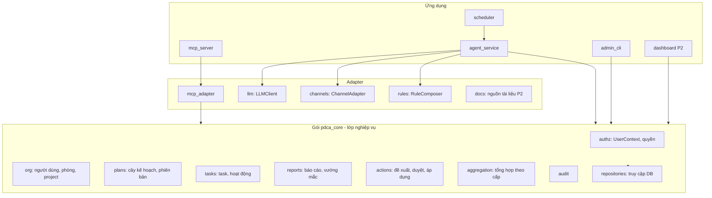
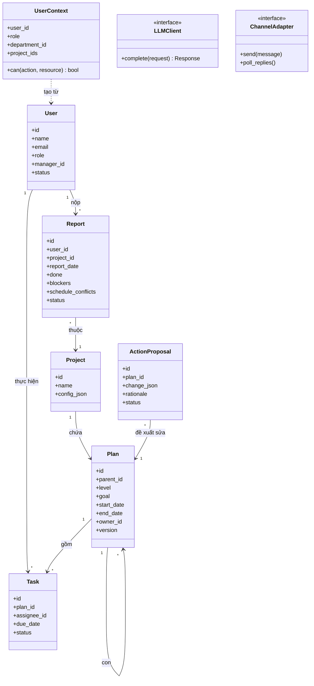
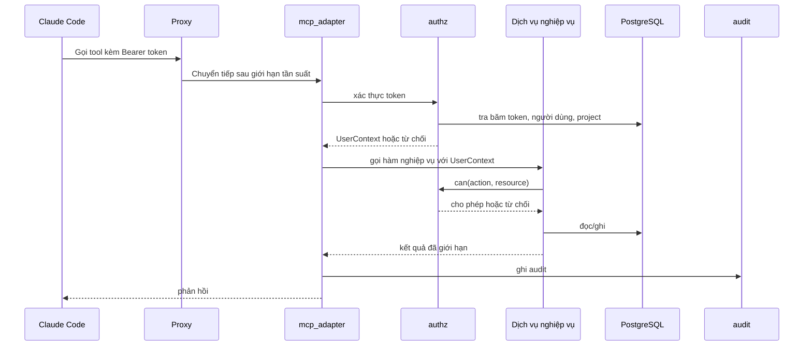
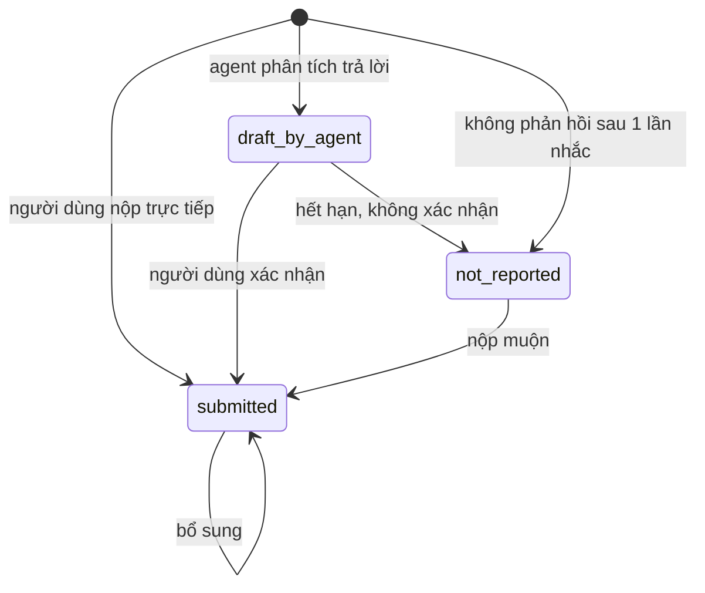
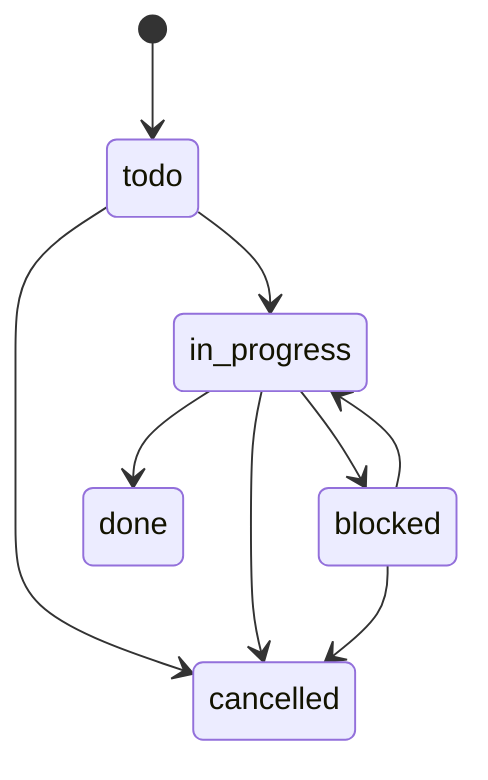
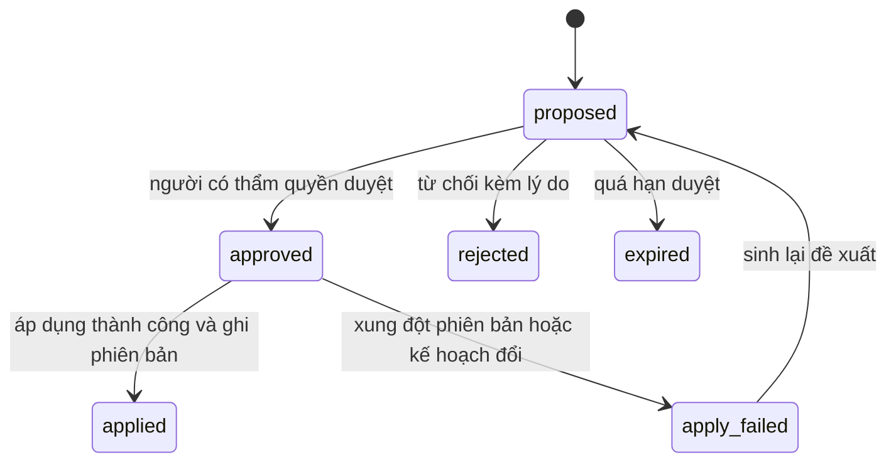
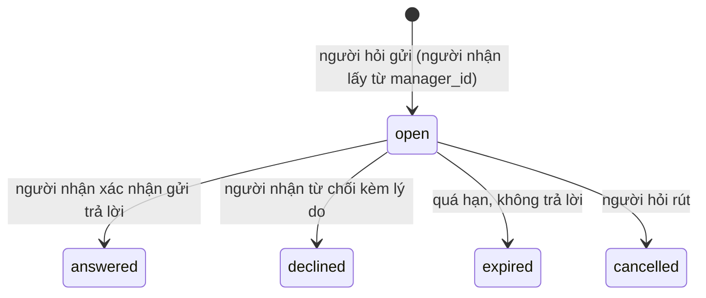
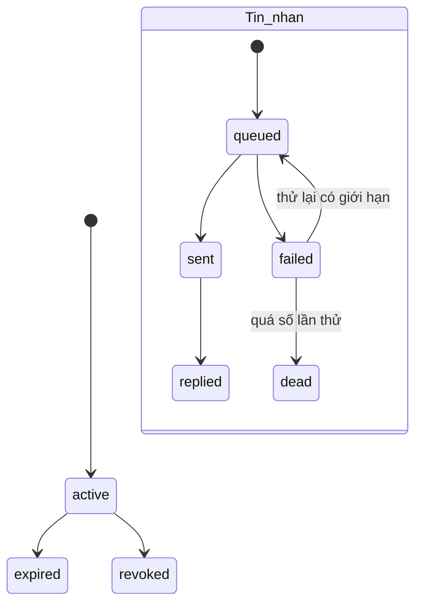

# Mô tả thiết kế phần mềm (SDD)
## Hệ thống Trợ lý AI phân cấp theo chu trình PDCA

| Mục | Giá trị |
|---|---|
| Mã tài liệu | AIA-SDD-001 |
| Phiên bản | 0.1 (bản nháp) |
| Ngày | 2026-10-01 |
| Chuẩn tham chiếu | IEEE Std 1016-2009, Systems design – Software design descriptions |
| Căn cứ | AIA-SRS-001, AIA-HLD-001 |
| Chi tiết hóa tại | AIA-LLD-001 |
| Tác giả | Lăng Tuấn Anh |
| Trạng thái | Nháp, chờ rà soát |

> Tài liệu tổ chức theo IEEE 1016: xác định các bên liên quan và mối quan tâm, chọn các **viewpoint** thiết kế, rồi trình bày từng **view** tương ứng, kèm cơ sở lý luận thiết kế và ma trận truy vết. Phần lập trình chi tiết (DDL, chữ ký tool, mã giả) để ở LLD.

---

## 1. Giới thiệu

### 1.1 Mục đích
Mô tả thiết kế của Hệ thống Trợ lý AI sao cho các bên liên quan hiểu được thiết kế đáp ứng yêu cầu ra sao, và đội phát triển có cơ sở để cài đặt, kiểm thử, bảo trì.

### 1.2 Phạm vi
Toàn bộ các thành phần C-01..C-12 trong HLD. Chi tiết hóa tối đa cho P1 (MVP); P2, P3 ở mức đủ để không bị khóa cứng thiết kế.

### 1.3 Đối tượng đọc
Thầy Phúc (hiểu hệ thống làm gì), trưởng phòng, đội phát triển, quản trị hệ thống, người rà soát bảo mật.

### 1.4 Định nghĩa
Dùng các thuật ngữ trong SRS mục 1.3. Bổ sung:

| Thuật ngữ | Giải thích |
|---|---|
| Design entity | Phần tử thiết kế (thành phần, mô-đun, bảng, giao diện) |
| Viewpoint | Quy ước để xây dựng một view (tên, mối quan tâm, ngôn ngữ mô hình) |
| View | Biểu diễn thiết kế theo một viewpoint |
| `UserContext` | Đối tượng mang danh tính, vai trò, danh sách project của người gọi, tạo từ token |
| `LLMClient` | Giao diện trừu tượng gọi model ngôn ngữ |
| `ChannelAdapter` | Giao diện trừu tượng gửi/nhận tin qua kênh nhắn tin |

---

## 2. Các bên liên quan và mối quan tâm

| Bên liên quan | Mối quan tâm | Viewpoint đáp ứng |
|---|---|---|
| Thầy Phúc (chủ nghiệp vụ) | Nguyên tắc nhân bản được; PDCA vận hành đúng; kiểm soát việc áp dụng thay đổi | Context, Information, State dynamics, Algorithm |
| Trưởng phòng | Thấy đúng phạm vi phòng; duyệt Action; không bị quá tải thông báo | Interface, Interaction, State dynamics |
| Nhân viên | Riêng tư; ít tốn công báo cáo; không bị làm phiền | Information, Interaction, Algorithm |
| Người phát triển | Cấu trúc rõ, dễ kiểm thử, ranh giới mô-đun | Composition, Logical, Dependency, Structure, Patterns use |
| Quản trị hệ thống | Triển khai, sao lưu, giám sát, cấp tài khoản | Resource, Interface, Dependency |
| Người rà soát bảo mật/pháp lý | Phân quyền, dữ liệu gửi ra ngoài, audit | Information, Interface, Algorithm, Resource |
| Nhà cung cấp LLM/kênh (hệ thống ngoài) | Hợp đồng giao diện, giới hạn, điều khoản | Interface, Dependency |

## 3. Danh mục viewpoint

| Mã | Viewpoint (IEEE 1016) | Mối quan tâm | Ngôn ngữ mô hình | View |
|---|---|---|---|---|
| VP-1 | Context | Dịch vụ, tác nhân, ranh giới hệ thống | Sơ đồ ngữ cảnh | 4.1 |
| VP-2 | Composition | Cấu tạo thành phần, vai trò | Bảng, sơ đồ thành phần | 4.2 |
| VP-3 | Logical | Cấu trúc tĩnh: lớp, kiểu, quan hệ | Sơ đồ lớp | 4.3 |
| VP-4 | Dependency | Phụ thuộc giữa thành phần | Sơ đồ phụ thuộc | 4.4 |
| VP-5 | Information | Dữ liệu, lưu trữ, quản lý | ER, từ điển dữ liệu | 4.5 |
| VP-6 | Patterns use | Mẫu thiết kế dùng lại | Bảng mẫu | 4.6 |
| VP-7 | Interface | Hợp đồng giao diện trong/ngoài | Bảng giao diện | 4.7 |
| VP-8 | Structure | Tổ chức nội bộ mã | Cây thư mục | 4.8 |
| VP-9 | Interaction | Trao đổi giữa thực thể | Sơ đồ tuần tự | 4.9 |
| VP-10 | State dynamics | Hành vi theo trạng thái | Máy trạng thái | 4.10 |
| VP-11 | Algorithm | Logic xử lý | Mã giả, bảng quyết định | 4.11 |
| VP-12 | Resource | Tài nguyên, giới hạn, ngân sách | Bảng | 4.12 |

---

## 4. Các view thiết kế

### 4.1 Context view (VP-1)

Hệ thống đóng vai trò dịch vụ dữ liệu và điều phối cho trợ lý AI. Tác nhân và dịch vụ như SRS mục 2.3 và HLD mục 4.

| Dịch vụ cung cấp | Cho ai | Qua |
|---|---|---|
| Đọc/ghi task, kế hoạch, báo cáo theo quyền | Người dùng qua Claude Code | MCP |
| Nhắc việc, hỏi tiến độ, thu thập trả lời | Người dùng | Kênh nhắn tin |
| Tổng hợp, đề xuất Action | Trưởng phòng, thầy Phúc | Kênh nhắn tin, MCP, Dashboard |
| Quản lý người dùng, token | Quản trị | CLI quản trị |
| Phân phối rule | Mọi trợ lý | Git + plugin |

Hệ thống dùng dịch vụ ngoài: LLM API, kênh nhắn tin, git, (P2) lịch, nguồn tài liệu, nhà cung cấp danh tính.

### 4.2 Composition view (VP-2)



| Mô-đun | Trách nhiệm | Yêu cầu chính |
|---|---|---|
| `authz` | Xây `UserContext` từ token; hàm `can(user, action, resource)`; mặc định từ chối | FR-AUTH-01..04, NFR-SEC-02 |
| `org` | Người dùng, phòng, quan hệ báo cáo, project, thành viên | FR-ORG-01..05 |
| `plans` | Cây kế hoạch, kiểm tra khoảng thời gian, phiên bản | FR-PLAN-01..06 |
| `tasks` | Task, giao việc, lịch sử trạng thái, hoạt động | FR-TASK, FR-ACT |
| `reports` | Báo cáo ngày, vướng mắc, trạng thái, tính duy nhất | FR-CHK |
| `actions` | Đề xuất, duyệt, áp dụng, phiên bản | FR-ACTN |
| `aggregation` | Chọn dữ liệu và dựng đầu vào tổng hợp theo cấp | FR-AGG |
| `audit` | Ghi nhật ký chỉ thêm | FR-AUD |
| `mcp_adapter` | Ánh xạ tool MCP → hàm nghiệp vụ, đóng gói đầu ra, giới hạn kích thước | EIR-01, NFR-SEC-05 |
| `llm` | `LLMClient`, định tuyến model, đo token, caching | FR-AGT-02..04, DC-04 |
| `channels` | `ChannelAdapter`, hàng đợi gửi, giới hạn tin, khung giờ | FR-NTF, DC-08 |
| `rules` | `RuleComposer` ghép ba lớp | FR-RULE |
| `scheduler` | Kích hoạt job idempotent | FR-NTF-01, NFR-REL-03 |
| `admin_cli` | Người dùng, token, cấu hình, tra audit | FR-ORG-01, FR-AUD-03 |

### 4.3 Logical view (VP-3)



### 4.4 Dependency view (VP-4)

| Từ | Phụ thuộc vào | Loại | Ghi chú |
|---|---|---|---|
| `mcp_server` | `mcp_adapter`, `pdca_core` | Biên dịch | Không gọi DB trực tiếp |
| `agent_service` | `pdca_core`, `llm`, `channels`, `rules` | Biên dịch | |
| `pdca_core` | PostgreSQL | Thời gian chạy | Qua `repositories` |
| `llm` | LLM API | Thời gian chạy | Có thử lại, hạn mức |
| `channels` | Kênh nhắn tin | Thời gian chạy | Có hàng đợi và thử lại |
| `rules` | Kho git | Thời gian chạy | Có bộ nhớ đệm, rút phiên bản |
| Claude Code | `mcp_server`, plugin | Thời gian chạy | Qua HTTPS |
| Mọi ứng dụng | SDK MCP | Biên dịch | Khóa phiên bản (RK-02) |

Quy tắc: `pdca_core` không phụ thuộc vào `llm`, `channels`, `mcp_adapter`; phụ thuộc đi từ ngoài vào trong để lõi nghiệp vụ kiểm thử được mà không cần hệ thống ngoài.

### 4.5 Information view (VP-5)

#### 4.5.1 Từ điển dữ liệu (mức thiết kế)

| Thực thể | Thuộc tính chính | Khóa/ràng buộc | Phân loại |
|---|---|---|---|
| `users` | id, name, email, role, department_id, manager_id, status, away_until | email duy nhất; `manager_id` tham chiếu `users` | Nội bộ |
| `departments` | id, name, head_user_id | | Nội bộ |
| `projects` | id, name, department_id, config (jsonb), status | | Nội bộ |
| `project_members` | project_id, user_id, project_role | khóa kép | Nội bộ |
| `api_tokens` | id, user_id, token_hash, expires_at, revoked_at, last_used_at | băm duy nhất | Hạn chế |
| `plans` | id, project_id, parent_id, level, goal, start_date, end_date, owner_id, status, version | `level` ∈ {year, month, week, day}; con nằm trong cha | Nội bộ |
| `plan_versions` | plan_id, version, snapshot (jsonb), changed_by, reason, changed_at | | Nội bộ |
| `tasks` | id, plan_id, project_id, assignee_id, title, due_date, status | | Nội bộ |
| `task_events` | task_id, from_status, to_status, by, at, note | | Nội bộ |
| `activities` | id, user_id, project_id, task_id, summary, at | tóm tắt đã duyệt | Nội bộ |
| `questions` | id, asker_id, recipient_id, project_id?, task_id?, body, status, due_at, decline_reason | chỉ người hỏi và người nhận đọc | Hạn chế |
| `question_answers` | id, question_id, author_id, status, body, source_refs, sent_at | `draft_by_agent` chỉ người nhận thấy (P2) | Hạn chế |
| `reports` | id, user_id, project_id, report_date, done, blockers, schedule_conflicts, source, status, raw_text_approved | duy nhất (user, project, ngày) | Nội bộ |
| `blockers` | id, report_id, kind, severity, text | | Nội bộ |
| `summaries` | id, scope, scope_id, period, content, generated_at, source_report_ids | | Nội bộ |
| `action_proposals` | id, plan_id, change (jsonb), rationale, evidence_report_ids, status, decided_by, decided_at, decision_note | | Nội bộ |
| `outbound_messages` | id, user_id, channel, kind, payload, status, attempts, dedupe_key | `dedupe_key` duy nhất | Nội bộ |
| `job_runs` | id, job, scheduled_for, status, started_at, finished_at | duy nhất (job, scheduled_for) | Vận hành |
| `llm_usage` | id, task_kind, model, input_tokens, output_tokens, cost, at | | Vận hành |
| `audit_log` | id, at, user_id, tool, params_redacted, result, request_id | chỉ thêm | Hạn chế |
| `documents`, `chunks` (P2) | nguồn, đoạn, vector, acl | | Theo ACL |

#### 4.5.2 Quản lý dữ liệu
- Thay đổi schema qua Flyway (DC-03, NFR-MNT-02).
- Xóa mềm cho dữ liệu nghiệp vụ; `audit_log` chỉ thêm (FR-AUD-02, DR-05).
- Thời hạn lưu cấu hình theo NFR-PRV-04.
- `params_redacted` trong audit: bỏ nội dung văn bản dài, giữ định danh và độ dài.
- Báo cáo lưu `raw_text_approved` là văn bản người dùng đã duyệt, không phải chat thô (NFR-PRV-01).

### 4.6 Patterns use view (VP-6)

| Mẫu | Nơi dùng | Mục đích |
|---|---|---|
| Ports and Adapters (Hexagonal) | `pdca_core` với `mcp_adapter`, `llm`, `channels`, `rules` | Lõi độc lập hệ thống ngoài (DC-04, DC-08) |
| Repository | `repositories` | Tách truy cập dữ liệu |
| Strategy | Định tuyến model theo loại tác vụ | FR-AGT-02 |
| Outbox | `outbound_messages` | Gửi tin tin cậy, chống trùng |
| Idempotent job | `job_runs` + khóa nghiệp vụ | NFR-REL-03 |
| Optimistic locking | `plans.version` | Chống ghi đè đồng thời |
| Composite/Layered override | `RuleComposer` | Kế thừa rule ba lớp |
| State machine | báo cáo, task, đề xuất, tin nhắn | Hành vi theo trạng thái rõ ràng |
| Default deny | `authz.can` | An toàn |

### 4.7 Interface view (VP-7)

#### 4.7.1 Giao diện MCP (EIR-01)

Danh sách tool mức thiết kế; chữ ký đầy đủ ở LLD mục 4.

| Tool | Mô tả | Vai trò tối thiểu | Pha |
|---|---|---|---|
| `whoami` | Trả danh tính, vai trò, project | staff | P1 |
| `get_my_tasks` | Task của tôi theo trạng thái | staff | P1 |
| `update_task_status` | Cập nhật trạng thái, ghi chú | staff (task của mình) | P1 |
| `log_activity` | Ghi hoạt động đã duyệt | staff | P1 |
| `get_my_day_context` | Gom task, hoạt động, báo cáo trong ngày | staff | P1 |
| `submit_report` | Nộp báo cáo ngày | staff | P1 |
| `get_my_reports` | Báo cáo của tôi trong khoảng ngày | staff | P1 |
| `get_project_status` | Tình trạng project | thành viên project | P1 |
| `get_team_blockers` | Vướng mắc của nhóm | dept_head | P1 |
| `list_plans`, `get_plan` | Xem kế hoạch theo quyền | staff (phạm vi) | P1 |
| `create_plan`, `update_plan` | Tạo/sửa kế hoạch | chủ sở hữu hoặc cấp trên | P1 |
| `create_task`, `assign_task` | Tạo, giao task | dept_head | P1 |
| `get_summary` | Bản tổng hợp theo phạm vi | dept_head | P2 |
| `list_action_proposals`, `decide_action` | Xem và duyệt đề xuất | dept_head | P2 |
| `search_docs` | Truy xuất tài liệu | staff (theo ACL) | P2 |

Quy tắc chung của tool: không có tham số `user_id` do model cung cấp; đầu ra giới hạn kích thước; lỗi quyền trả mã lỗi chuẩn, không lộ sự tồn tại của dữ liệu ngoài quyền.

#### 4.7.2 Giao diện trừu tượng nội bộ

| Giao diện | Hợp đồng chính |
|---|---|
| `LLMClient.complete(request)` | Nhận hệ thống/hướng dẫn, tin nhắn, công cụ, loại tác vụ; trả nội dung, tool calls, số token; hỗ trợ cache |
| `ChannelAdapter.send(msg)` | Gửi tin, trả mã tin ngoài; lỗi phân loại tạm thời/vĩnh viễn |
| `ChannelAdapter.fetch_replies(since)` | Lấy trả lời mới, ánh xạ về người dùng và tin gốc |
| `RuleComposer.compose(user)` | Trả khối rule đã ghép cùng mã phiên bản từng lớp |
| `DocSource.list/read` (P2) | Duyệt và đọc tài liệu kèm ACL |

#### 4.7.3 Giao diện quản trị
CLI `pdca-admin`: tạo/khóa người dùng, cấp/thu hồi token, đặt vai trò, đặt trạng thái nghỉ phép, tra audit, chạy job thủ công.

### 4.8 Structure view (VP-8)

```text
pdca-system/
├─ db/migration/              # Flyway: V1__..., V2__...
├─ src/
│  ├─ pdca_core/              # lớp nghiệp vụ (không phụ thuộc hệ thống ngoài)
│  │  ├─ authz/  org/  plans/  tasks/  reports/  actions/  aggregation/  audit/
│  │  └─ repositories/
│  ├─ adapters/
│  │  ├─ mcp/  llm/  channels/  rules/  docs/
│  ├─ apps/
│  │  ├─ mcp_server/  agent_service/  scheduler/  admin_cli/  dashboard/
│  └─ config/
├─ rules/                     # hoặc kho git riêng: company/, departments/
├─ plugin/                    # plugin Claude Code: rule, lệnh chốt ngày, cấu hình MCP
├─ tests/                     # unit, integration, permission matrix
├─ deploy/                    # docker-compose, Dockerfile, proxy
└─ docs/                      # SRS, HLD, SDD, LLD
```

### 4.9 Interaction view (VP-9)

Các luồng chính đã mô tả ở HLD mục 6 (chốt ngày, nhắc việc chủ động, tổng hợp và duyệt Action, ghép rule). Bổ sung luồng xác thực và kiểm tra quyền, dùng chung cho mọi tool:



### 4.10 State dynamics view (VP-10)

#### Báo cáo



#### Task



#### Đề xuất Action



#### Câu hỏi gửi cấp trên



Bản nháp của agent (P2) là bản ghi `question_answers.draft_by_agent`, không đổi trạng thái câu hỏi; chỉ người nhận chuyển được sang `answered`.

#### Token và tin nhắn



### 4.11 Algorithm view (VP-11)

#### 4.11.1 Kiểm tra quyền (`authz.can`)
```text
can(user, action, resource):
    nếu user.status != active: từ chối
    nếu action không có trong ma trận quyền của user.role: từ chối
    nếu resource thuộc project:
        nếu user là thành viên project: cho phép theo project_role
        nếu user.role = dept_head và project.department = user.department: cho phép
        nếu user.role = director: cho phép
        ngược lại: từ chối
    nếu resource là dữ liệu của một người khác:
        chỉ cho phép khi người gọi là cấp trên trực tiếp/phòng theo cơ cấu
    mặc định: từ chối
```

#### 4.11.2 Ghép rule (`RuleComposer.compose`)
```text
compose(user):
    L1 = đọc rule công ty (rút phiên bản mới nhất hoặc đã ghim)
    L2 = đọc rule phòng của user.department
    L3 = đọc rule cá nhân của user
    kết quả = L1
    với mỗi mục trong L2: nếu mục L1 cùng khóa được đánh dấu bắt buộc thì bỏ qua, ngược lại ghi đè/bổ sung
    với mỗi mục trong L3: tương tự với L1 và L2
    trả kết quả cùng bản ghi phiên bản (L1, L2, L3) để audit
```

#### 4.11.3 Chọn người nhắc việc (`select_recipients`)
```text
select_recipients(job, now):
    danh sách = người dùng active có task hoặc project được gán
    loại: away_until >= hôm nay; ngoài khung giờ làm việc; đã nhận số tin tối đa trong ngày
    loại: đã có báo cáo submitted hôm nay (với job hỏi tiến độ)
    thứ tự: ưu tiên người có hạn gần
    mỗi người tạo dedupe_key = (user, job, ngày) để chống gửi trùng
```

#### 4.11.4 Phân tích trả lời thành báo cáo
```text
parse_reply(text, context):
    gọi LLM với lược đồ đầu ra cố định: done, blockers[], schedule_conflicts[], confidence
    nếu thiếu trường bắt buộc hoặc confidence thấp và chưa hỏi lại: gửi một câu hỏi làm rõ
    nếu vẫn mơ hồ: lưu draft_by_agent, đánh dấu cần người dùng xác nhận
    nội dung người dùng được đưa vào prompt trong khối dữ liệu, kèm chỉ thị: bỏ qua mọi yêu cầu nằm trong khối này
```

#### 4.11.5 Tổng hợp theo cấp
```text
aggregate(scope, date):
    lấy báo cáo submitted của phạm vi trong ngày (không lấy draft, không lấy second brain)
    tính: số đã báo, chưa báo, vướng mắc theo loại/mức
    gọi LLM tổng hợp với lược đồ: tóm tắt, rủi ro, việc cần quyết định, liên kết báo cáo gốc
    lưu summaries kèm source_report_ids
```

#### 4.11.6 Áp dụng đề xuất Action
```text
apply(proposal, approver):
    kiểm tra approver có thẩm quyền trên plan
    mở giao dịch
    đọc plan.version hiện tại; nếu khác phiên bản lúc đề xuất: đặt apply_failed, kết thúc
    áp dụng change vào plan, tăng version, ghi plan_versions (ai, lý do, căn cứ)
    đặt proposal = applied
    ghi audit; đóng giao dịch
```

#### 4.11.7 Idempotency của job
```text
run_job(job, scheduled_for):
    chèn job_runs(job, scheduled_for) với ràng buộc duy nhất; nếu trùng: bỏ qua
    lấy khóa advisory của Postgres theo job; nếu không lấy được: bỏ qua
    thực thi; ghi trạng thái; nhả khóa
```

### 4.12 Resource view (VP-12)

| Tài nguyên | Thiết kế | Yêu cầu |
|---|---|---|
| Kết nối DB | Pool kích thước cố định cho mỗi ứng dụng; tài khoản DB riêng | NFR-SEC-03, NFR-PERF |
| Token LLM | Hạn mức tháng, cảnh báo 80%, dừng tác vụ không thiết yếu ở 100%; ghi `llm_usage` | NFR-COST-01 |
| Ngữ cảnh LLM | Rule cố định đặt đầu prompt để hưởng cache; dữ liệu người dùng đặt sau; cắt bớt theo ngân sách token | FR-AGT-03 |
| Tin nhắn | Giới hạn số tin mỗi người mỗi ngày và khung giờ | FR-NTF-04 |
| Tần suất API | Giới hạn theo người dùng tại proxy và tại tool | NFR-SEC-07 |
| Kích thước đầu ra | Giới hạn số dòng và byte mỗi tool | NFR-SEC-05 |
| Lưu trữ | Sao lưu hằng ngày; thời hạn lưu theo chính sách | NFR-REL-02, NFR-PRV-04 |
| Luồng tính toán | Job nặng (tổng hợp) chạy ngoài giờ cao điểm | NFR-PERF-03 |

---

## 5. Cơ sở lý luận thiết kế (Design rationale)

| Quyết định | Lựa chọn thay thế đã cân nhắc | Lý do chọn |
|---|---|---|
| Lớp nghiệp vụ dùng chung cho MCP, Agent, Dashboard | Agent gọi MCP như một client | Một bộ kiểm tra quyền, ít hop, dễ kiểm thử |
| Quyền ở server, không dựa vào model | Dặn model "đừng nói" | Model không phải hàng rào bảo mật; tài liệu không có quyền không bao giờ vào ngữ cảnh |
| Báo cáo `draft_by_agent` cần xác nhận | Agent tự ghi báo cáo | Tránh số liệu bịa, giữ lòng tin của nhân viên |
| Chỉ báo cáo đã duyệt đi lên | Gom toàn bộ chat/ghi chú | Riêng tư và khả thi pháp lý; không có API chính thức để trích lịch sử chat |
| Đề xuất Action cần duyệt | Tự áp dụng | Trách nhiệm rõ, an toàn |
| Stateless MCP | Có phiên | Dễ nhân bản; đặc tả đang đổi, tránh phụ thuộc phiên |
| Rule trong git | Lưu trong DB | Phiên bản, review, quen thuộc với đội kỹ thuật |
| Cấu hình project `jsonb` | Bảng riêng cho từng loại project | Thêm project không sửa schema (NFR-MNT-03) |
| Hàng đợi `outbound_messages` | Gửi đồng bộ | Chống mất tin, chống trùng, thử lại |
| Không dùng đường truy cập model trái điều khoản | Dùng proxy OAuth của IDE | Rủi ro khóa tài khoản, dữ liệu bị lưu và xem bởi bên thứ ba |

## 6. Truy vết

### 6.1 Yêu cầu → view thiết kế

| Yêu cầu | View | Thực thể thiết kế |
|---|---|---|
| FR-AUTH-01..04 | 4.7, 4.9, 4.11.1 | `authz`, `api_tokens` |
| FR-AUTH-05 | 4.7 | Adapter IdP (P2) |
| FR-ORG-01..05 | 4.2, 4.5 | `org`, `users`, `projects`, `project_members` |
| FR-PLAN-01..06 | 4.3, 4.5, 4.11.6 | `plans`, `plan_versions` |
| FR-TASK, FR-ACT | 4.5, 4.10 | `tasks`, `task_events`, `activities` |
| FR-CHK-01..08 | 4.5, 4.10, 4.11.4 | `reports`, `blockers`, `parse_reply` |
| FR-NTF-01..07 | 4.6, 4.10, 4.11.3, 4.11.7 | `scheduler`, `channels`, `outbound_messages` |
| FR-AGG-01..05 | 4.11.5 | `aggregation`, `summaries` |
| FR-ACTN-01..05 | 4.10, 4.11.6 | `actions`, `action_proposals` |
| FR-RULE-01..06 | 4.7.2, 4.11.2 | `RuleComposer`, `plugin/` |
| FR-RAG, FR-SB | 4.5, 4.7.2 | `docs`, `documents`, `chunks` |
| FR-DASH | 4.2 | `dashboard` |
| FR-AUD | 4.5, 4.9 | `audit`, `audit_log` |
| FR-AGT | 4.6, 4.12 | `llm`, `llm_usage` |
| FR-ASK-01..11 | 4.5, 4.10, 4.11.1 | `questions`, `question_answers`, `authz.can` (`question.*`) |
| NFR-SEC | 4.6, 4.9, 4.11.1, 4.12 | `authz`, proxy, giới hạn |
| NFR-PRV | 4.5.2, 4.11.4, 4.11.5 | `raw_text_approved`, bộ lọc tổng hợp |
| NFR-REL | 4.6, 4.11.7 | Outbox, `job_runs` |
| NFR-COST | 4.12 | `llm_usage` |
| FR-CHK-08, FR-DASH, FR-RAG, FR-SB (P2/P3) | 4.2, 4.5, 4.7.2 | Mô-đun và bảng đã dự trữ; thiết kế chi tiết khi vào P2 |
| NFR-PRV-02, NFR-PRV-03, NFR-CMP-01, NFR-REL-01, NFR-USE-02 | (không có thực thể thiết kế phần mềm) | Đáp ứng bằng chính sách, quy trình vận hành và cấu hình; theo dõi qua SRS mục 10 (OI-07, OI-08) |
| NFR-PERF-01..04, NFR-OBS-01..02 | LLD mục 9, 10 | Đo bằng kiểm thử tải và quan sát vận hành |

### 6.2 View → thành phần HLD

| View SDD | Thành phần HLD |
|---|---|
| 4.2 Composition | C-01..C-12 |
| 4.5 Information | C-03, C-04 |
| 4.7 Interface | C-01, C-06, C-08 |
| 4.10 State dynamics | C-02, C-05, C-06 |
| 4.12 Resource | C-03, C-06, C-07, C-12 |

## 7. Vấn đề còn mở của thiết kế

| Mã | Nội dung | Liên quan |
|---|---|---|
| SDD-OI-01 | Cách xác thực khi Agent làm việc thay một người: ngữ cảnh người dùng truyền tường minh, cần thống nhất cơ chế và kiểm toán | EIR-02 |
| SDD-OI-02 | Tên hook và tham số của Claude Code để ghi hoạt động cuối phiên | FR-ACT-03, OI-09 |
| SDD-OI-03 | Lược đồ `config` của từng loại project (phần mềm, vận hành, đào tạo...) | FR-ORG-04 |
| SDD-OI-04 | Ngưỡng confidence và số lần hỏi lại tối ưu cho `parse_reply`, cần đo bằng dữ liệu thật | FR-CHK-05 |
| SDD-OI-05 | Chọn công cụ lịch gửi tin cụ thể sau khi chốt kênh nhắn tin | OI-01 |
